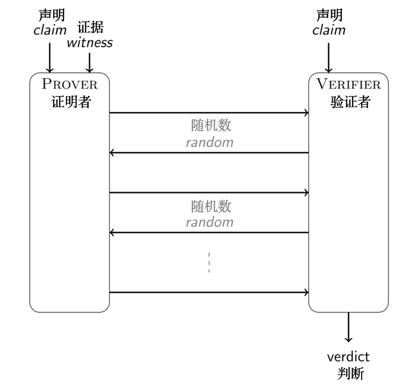
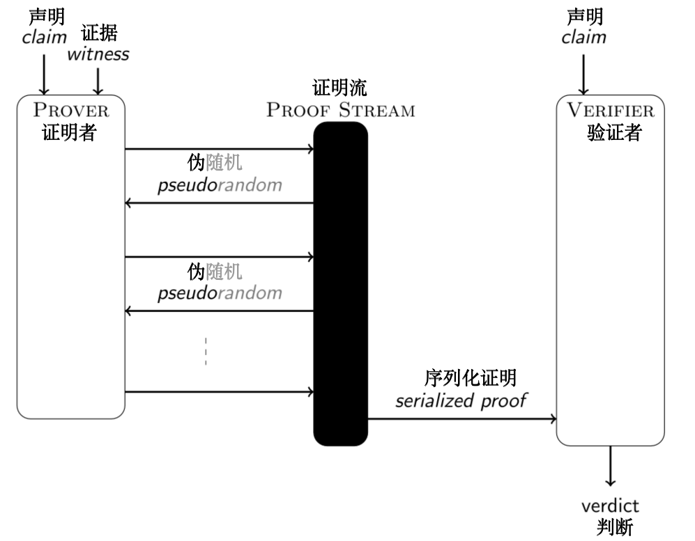
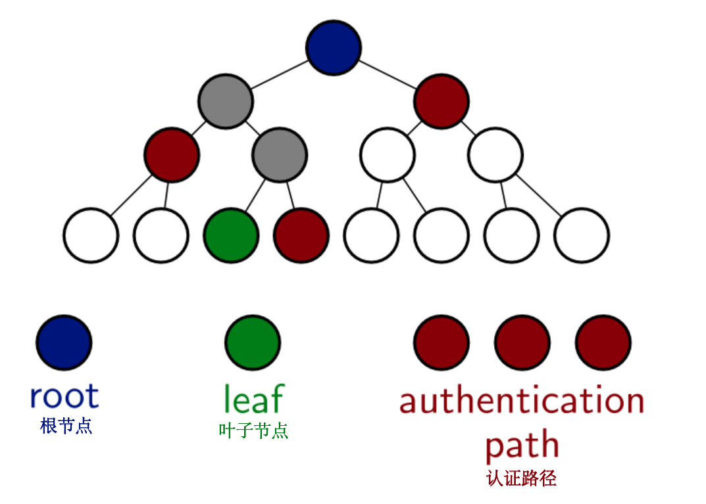

# 📃 STARK 算法解析（第 2 部分: 有用的“工具”）

# 1. 有限域运算

[有限域](https://en.wikipedia.org/wiki/Finite_field)在整个密码学中无处不在，因为它们与计算机天然兼容。例如，它们不会产生上溢或下溢错误，而且有限域中的每个元素也都有一个对应的有限比特的表示形式。

构造一个有限域的最简单方法是选择一个素数 $$p$$，得到 $$\mathbb{F}_p \stackrel{\triangle}{=} \lbrace 0, 1, \ldots, p-1\rbrace$$，并使用整数运算法则来“类比定义”一般的加法和乘法运算，最后将结果模 $$p$$ 以约束结果的取值范围，使得运算结果仍落在此数域内。减法相当于把被减数与减数的相反数相加，其中相反数相当于乘以 $$-1$$（在有限域内 $$-1 \equiv p-1 \space \mod \space p $$ ）。类似地，除法相当于被乘数乘以乘数的逆元。其中，逆元可以通过[扩展欧几里得算法](https://en.wikipedia.org/wiki/Extended_Euclidean_algorithm)求得，该算法在输入两个整数 $$x$$ 和 $$y$$ 后，返回它们的最大公因数 $$g$$ 以及裴蜀定理所匹配的对应系数 $$a, b$$，使得 $$ax + by = g$$。事实上，只要 $$\gcd(x,p) = 1$$，$$x \in \mathbb{F}_p$$ 的逆元就是 $$a$$，因为 $$ax + bp \equiv 1 \space \mod \space p$$。有限域中元素的幂可以用[平方-乘](https://en.wikipedia.org/wiki/Exponentiation_by_squaring)算法来计算，该算法在由指数扩展出的比特位上进行迭代，在每次迭代中对累加器变量进行平方，如果该比特位已被设置，则需额外乘以基底元素。

为了构造 STARKs，我们需要具有以下特殊结构的有限域：<font color="708090">（笔者注：实际上，StarkWare 团队刚发表的一篇[精彩的论文](https://arxiv.org/pdf/2107.08473.pdf)展示了如何在任何有限域中应用同样的方法，无论它是否具有特殊结构。本教程会使用结构化有限域，以简单的方式来解释构造。）</font>它需要包含一个阶为 $$2^k$$（$$k$$ 是一个足够大的数）的子结构。我们考虑素域，其定义模数的形式为 $$p = f \cdot 2^k + 1$$ ，其中 $$f$$ 是使得该数成为素数的协因子。在这种情况下，群 $$\mathbb{F}_p \backslash \lbrace 0\rbrace, \times$$ 有一个阶为 $$2^k$$ 的子群。 实际上，我们可以将这个子群等同于均匀分布在复数单位圆上的 $$2^k$$ 个点。
下面介绍用于计算乘法逆元的方法，它是以扩展欧几里得算法为起点展开的。
```python
ef xgcd( x, y ):
    old_r, r = (x, y)
    old_s, s = (1, 0)
    old_t, t = (0, 1)

    while r != 0:
        quotient = old_r // r
        old_r, r = (r, old_r - quotient * r)
        old_s, s = (s, old_s - quotient * s)
        old_t, t = (t, old_t - quotient * t)

    return old_s, old_t, old_r # a, b, g
```

将关于域的逻辑与关于域中元素的逻辑区分开是有意义的。为此，域元素会包含一个域对象来作为合适的域；这个域对象实现了相应的算术运算。此外，python 支持运算符重载，因此我们可以重新利用一般算术运算符来进行域中的算术运算。

```python
class FieldElement:
    def __init__( self, value, field ):
        self.value = value
        self.field = field

    def __add__( self, right ):
        return self.field.add(self, right)

    def __mul__( self, right ):
        return self.field.multiply(self, right)

    def __sub__( self, right ):
        return self.field.subtract(self, right)

    def __truediv__( self, right ):
        return self.field.divide(self, right)

    def __neg__( self ):
        return self.field.negate(self)

    def inverse( self ):
        return self.field.inverse(self)

    # modular exponentiation -- be sure to encapsulate in parentheses!
    def __xor__( self, exponent ):
        acc = FieldElement(1, self.field)
        val = FieldElement(self.value, self.field)
        for i in reversed(range(len(bin(exponent)[2:]))):
            acc = acc * acc
            if (1 << i) & exponent != 0:
                acc = acc * val
        return acc

    def __eq__( self, other ):
        return self.value == other.value

    def __neq__( self, other ):
        return self.value != other.value

    def __str__( self ):
        return str(self.value)

    def __bytes__( self ):
        return bytes(str(self).encode())

    def is_zero( self ):
        if self.value == 0:
            return True
        else:
            return False

class Field:
    def __init__( self, p ):
        self.p = p

    def zero( self ):
        return FieldElement(0, self)

    def one( self ):
        return FieldElement(1, self)

    def multiply( self, left, right ):
        return FieldElement((left.value * right.value) % self.p, self)

    def add( self, left, right ):
        return FieldElement((left.value + right.value) % self.p, self)

    def subtract( self, left, right ):
        return FieldElement((self.p + left.value - right.value) % self.p, self)

    def negate( self, operand ):
        return FieldElement((self.p - operand.value) % self.p, self)

    def inverse( self, operand ):
        a, b, g = xgcd(operand.value, self.p)
        return FieldElement(a, self)

    def divide( self, left, right ):
        assert(not right.is_zero()), "divide by zero"
        a, b, g = xgcd(right.value, self.p)
        return FieldElement(left.value * a % self.p, self)
```

通用的实现域是很好的。然而，在本教程中，除了具有 $$1+407 \cdot 2^{119}$$ 个元素的域，我们将不会使用任何其他的域，该域具有足够大的阶为“二的幂”的子群。

```python
    def main():
        p = 1 + 407 * ( 1 << 119 ) # 1 + 11 * 37 * 2^119
        return Field(p)
```

除了确保阶为“二的幂”的子群的存在性，代码还需要为用户提供“整个乘法群”的以及“阶数为‘二的幂’的子群”的生成元。这样一个 $$n$$ 阶子群的生成元将被称为 $$n$$ 次本原单位根。

```python
    def generator( self ):
        assert(self.p == 1 + 407 * ( 1 << 119 )), "Do not know generator for other fields beyond 1+407*2^119"
        return FieldElement(85408008396924667383611388730472331217, self)
        
    def primitive_nth_root( self, n ):
        if self.p == 1 + 407 * ( 1 << 119 ):
            assert(n <= 1 << 119 and (n & (n-1)) == 0), "Field does not have nth root of unity where n > 2^119 or not power of two."
            root = FieldElement(85408008396924667383611388730472331217, self)
            order = 1 << 119
            while order != n:
                root = root^2
                order = order/2
            return root
        else:
            assert(False), "Unknown field, can't return root of unity."
```

最后，该协议要求支持对域元素进行随机和伪随机采样。为此，用户需提供随机字节，域逻辑将它们变成域元素。用户应注意提供足够数量的随机字节。

```python
  def sample( self, byte_array ):
        acc = 0
        for b in byte_array:
            acc = (acc << 8) ^ int(b)
        return FieldElement(acc % self.p, self)
```

# 2. 单变量多项式

单变量多项式是一个单一形式的未定元的非负幂加权和。我们把多项式写成各项之和的形式，即 $$f(X) = c_0 + c_1 \cdot X + \cdots + c_d X^d$$ 或 $$f(X) = \sum_{i=0}^d c_i X^i$$，因为 
1. 未定元 $$X$$ 的值通常是未知的；
2. 这种形式强调了多项式的构建来源，因此更有助于获得直观性的认识。在这些表达式中，$$c_i$$ 是多项式的***系数***，$$d$$ 是多项式的阶数。

单变量多项式在证明系统中是非常有用的，因为适用于多项式系数向量之间的关系，可以扩展到多项式在更大的域中的值。如果两个多项式是相等的，它们在任何地方都是相等的；而如果它们是不相等的，它们几乎在任何地方都是不相等的。通过这一特点，单变量多项式将对大向量的断言，归约为对其相应多项式在一小部分足够随机的点上的值的断言。

单变量多项式的代数实现从重载标准算术运算符开始，以计算多项式系数向量的正确函数。其中，有一个重要的问题需要特别注意。多项式的*首项系数*不可能是零，因为首项系数指的是最高度数的非零项的系数。然而，最终实现的系数向量可能有尾部的零，这些零应该被忽略。此时，阶数函数 就派上用场了；它的值被定义为“忽略尾部零后的系数向量的长度”减 1。这也意味着零多项式的阶数会为 -1，虽然实际上用 -∞ 表示更合适。

```python
from algebra import *

class Polynomial:
    def __init__( self, coefficients ):
        self.coefficients = [c for c in coefficients]

    def degree( self ):
        if self.coefficients == []:
            return -1
        zero = self.coefficients[0].field.zero()
        if self.coefficients == [zero] * len(self.coefficients):
            return -1
        maxindex = 0
        for i in range(len(self.coefficients)):
            if self.coefficients[i] != zero:
                maxindex = i
        return maxindex

    def __neg__( self ):
        return Polynomial([-c for c in self.coefficients])

    def __add__( self, other ):
        if self.degree() == -1:
            return other
        elif other.degree() == -1:
            return self
        field = self.coefficients[0].field
        coeffs = [field.zero()] * max(len(self.coefficients), len(other.coefficients))
        for i in range(len(self.coefficients)):
            coeffs[i] = coeffs[i] + self.coefficients[i]
        for i in range(len(other.coefficients)):
            coeffs[i] = coeffs[i] + other.coefficients[i]
        return Polynomial(coeffs)

    def __sub__( self, other ):
        return self.__add__(-other)

    def __mul__(self, other ):
        if self.coefficients == [] or other.coefficients == []:
            return Polynomial([])
        zero = self.coefficients[0].field.zero()
        buf = [zero] * (len(self.coefficients) + len(other.coefficients) - 1)
        for i in range(len(self.coefficients)):
            if self.coefficients[i].is_zero():
                continue # optimization for sparse polynomials
            for j in range(len(other.coefficients)):
                buf[i+j] = buf[i+j] + self.coefficients[i] * other.coefficients[j]
        return Polynomial(buf)

    def __eq__( self, other ):
        if self.degree() != other.degree():
            return False
        if self.degree() == -1:
            return True
        return all(self.coefficients[i] == other.coefficients[i] for i in range(len(self.coefficients)))

    def __neq__( self, other ):
        return not self.__eq__(other)

    def is_zero( self ):
        if self.degree() == -1:
            return True
        return False

    def leading_coefficient( self ):
        return self.coefficients[self.degree()]
```

当想要实现多项式的除法时，事情变得有点棘手。教科书算法背后的原理是：在每一次迭代中，你都要将被除数乘以一个“正确的项”，以便消去首项。一旦没有这样的“正确的项”存在，你就获得了余数。

```python
    def divide( numerator, denominator ):
        if denominator.degree() == -1:
            return None
        if numerator.degree() < denominator.degree():
            return (Polynomial([]), numerator)
        field = denominator.coefficients[0].field
        remainder = Polynomial([n for n in numerator.coefficients])
        quotient_coefficients = [field.zero() for i in range(numerator.degree()-denominator.degree()+1)]
        for i in range(numerator.degree()-denominator.degree()+1):
            if remainder.degree() < denominator.degree():
                break
            coefficient = remainder.leading_coefficient() / denominator.leading_coefficient()
            shift = remainder.degree() - denominator.degree()
            subtractee = Polynomial([field.zero()] * shift + [coefficient]) * denominator
            quotient_coefficients[shift] = coefficient
            remainder = remainder - subtractee
        quotient = Polynomial(quotient_coefficients)
        return quotient, remainder

    def __truediv__( self, other ):
        quo, rem = Polynomial.divide(self, other)
        assert(rem.is_zero()), "cannot perform polynomial division because remainder is not zero"
        return quo

    def __mod__( self, other ):
        quo, rem = Polynomial.divide(self, other)
        return rem
```

在基本的算术运算方面，最好有一个“求幂映射”，主要是为了便于符号上的简单表示而不是为了提高性能。

```python
    def __xor__( self, exponent ):
        if self.is_zero():
            return Polynomial([])
        if exponent == 0:
            return Polynomial([self.coefficients[0].field.one()])
        acc = Polynomial([self.coefficients[0].field.one()])
        for i in reversed(range(len(bin(exponent)[2:]))):
            acc = acc * acc
            if (1 << i) & exponent != 0:
                acc = acc * self
        return acc
```

如果一个多项式不允许在任意给定点上计算它的值，那么这个多项式就是毫无意义的。对于 STARKs，我们需要更为通用——在一个整环上的多项式求值，而不仅仅是在一个单一的点上求值。性能现在还并不是需要考虑的问题，所以下面的实现遵循一个简单的迭代方法。反方面，STARKs 也需要多项式插值，其中 x 坐标是另一些已知范围内的值。性能不是一个现在要考虑的问题，因此，目前标准的[拉格朗日插值](https://en.wikipedia.org/wiki/Lagrange_polynomial)已经足够了。

```python
def evaluate( self, point ):
        xi = point.field.one()
        value = point.field.zero()
        for c in self.coefficients:
            value = value + c * xi
            xi = xi * point
        return value

    def evaluate_domain( self, domain ):
        return [self.evaluate(d) for d in domain]

    def interpolate_domain( domain, values ):
        assert(len(domain) == len(values)), "number of elements in domain does not match number of values -- cannot interpolate"
        assert(len(domain) > 0), "cannot interpolate between zero points"
        field = domain[0].field
        x = Polynomial([field.zero(), field.one()])
        acc = Polynomial([])
        for i in range(len(domain)):
            prod = Polynomial([values[i]])
            for j in range(len(domain)):
                if j == i:
                    continue
                prod = prod * (x - Polynomial([domain[j]])) * Polynomial([(domain[i] - domain[j]).inverse()])
            acc = acc + prod
        return acc
```

说到整环 ：有一件事经常出现，就是计算在其上会“消失”的多项式。任何这样的多项式都是 $$Z_D(X) = \prod_{d \in D} (X-d)$$ 的倍数， 其为最低阶首一多项式，在 $$D$$ 内所有点上取值为 0，这个多项式通常被称为“消失多项式”，有时也被称为“归零多项式”<font color="708090">(zerofier)</font>。本教程更倾向于第二个描述方式。

```python
    def zerofier_domain( domain ):
        field = domain[0].field
        x = Polynomial([field.zero(), field.one()])
        acc = Polynomial([field.one()])
        for d in domain:
            acc = acc * (x - Polynomial([d]))
        return acc
```

另一个有用的工具是缩放多项式的能力。具体来说，这意味着从 $$f(X)$$ 的系数中获得 $$f(c \cdot X)$$ 的系数向量。当 $$f(X)$$ 被定义为在 $$c$$ 的幂上取值的序列（即 $$v_i = f(c^i)$$ ）时，这个功能就特别有用，那么 $$f(c \cdot X)$$ 代表相同的数值序列，只是都平移了一位。

```python
 def scale( self, factor ):
        return Polynomial([(factor^i) * self.coefficients[i] for i in range(len(self.coefficients))])
```

单变量多项式模块定义的最后一个函数预示着 FRI 协议中的一个关键操作，即测试三个点是否落在同一条线上——它有一个花哨的名字：*共线性*。

```python
def test_colinearity( points ):
    domain = [p[0] for p in points]
    values = [p[1] for p in points]
    polynomial = Polynomial.interpolate_domain(domain, values)
    return polynomial.degree() == 1
```

在进入下一节之前，值得停下来注意的是，对于有限扩域，或者简单说——扩域，所有要提前说明的内容都已经说完了。一个有限域只是一个配备了加法和乘法运算符的集合，这些运算符的运算规则符合高中所学的代数规则，例如，每个非零元素都有一个逆元、任意两个非零元素相乘不可能得到零，等等。有两种方法可以得到这样的域：

1. 从整数集开始，将任何加法或乘法的结果模去一个给定的质数 $$p$$。
2. 从有限域上的多项式集合开始，利用不可约多项式 $$p(X)$$ 来化简任何加法或乘法的结果（化简方式：将所得结果模 $$p(X)$$）。 当一个多项式不能被分解为两个较小的多项式的乘积时，它就是不可约的，其定义类似于素数。
重点是，只要后续步骤使用先前步骤的扩域，就可以在比密码学编译步骤更小的域中进行算术化操作。具体来说，例如：[EthSTARK](https://github.com/starkware-libs/ethSTARK) 在由 62 位素数定义的有限域上进行操作，但 FRI 步骤在其二次扩域上进行操作，以达到更高的安全级别。
本教程不使用扩域，对该主题的详细介绍超出了本教程讨论范围。

# 3. 多变量多项式

*多变量多项式*将单变量多项式推广到多个未定元——不仅仅是 $$X$$，而是 $$X, Y, Z, \ldots$$ 单变量多项式有助于将关于“大向量”的大断言化简为关于随机点“标量值”的小断言，多变量多项式有助于阐明计算完整性所满足的算术化约束。

例如，考虑[算术几何平均数](https://en.wikipedia.org/wiki/Arithmetic–geometric_mean)，它被定义为序列 $$(a, b) \mapsto \left( \frac{a+b}{2}, \sqrt{a \cdot b} \right)$$ 的第一或第二坐标的极限（两极限最终收敛于相同的数），其中 $$(a_0, b_0)$$ 为起始点。<font color="708090">（笔者注：证明有限域元素的代数-几何平均数的计算完整性没有任何意义，不用太在意，这里提及它仅仅是用于举例）</font>为了证明这个过程的几次迭代的完整性，需要的是一组多变量多项式，它捕获到一次正确迭代的约束条件，这些约束条件与当前状态 $$X_0, X_1$$ 和后续状态 $$Y_0, Y_1$$ 相关。在这句话中，“捕获”一词的意思是，如果计算是完整的，那么多项式的求值结果为零。这些多项式可能通过以下的形式出现：$$m_0(X_0, X_1, Y_0, Y_1) = Y_0 - \frac{X_0 + X_1}{2}$$，$$m_1(X_0, X_1, Y_0, Y_1) = Y_1^2 - X_0 \cdot X_1$$（此处应当注意：$$m_1(X_0, X_1, Y_0, Y_1) = Y_1 - \sqrt{X_0 \cdot X_1}$$ 实际上并不是一个多项式，尽管它有相同个数的零）

实现单变量多项式的结构是一个系数列表，多变量多项式的结构是一个将“指数向量”映射到“系数”的字典。只要这个“字典”映射的系数为零，该条映射关系就应当被忽略。同前文实现步骤一样，首先重载标准算术运算符、基本构造函数和标准功能。

```python
class MPolynomial:
    def __init__( self, dictionary ):
        self.dictionary = dictionary

    def zero():
        return MPolynomial(dict())

    def __add__( self, other ):
        dictionary = dict()
        num_variables = max([len(k) for k in self.dictionary.keys()] + [len(k) for k in other.dictionary.keys()])
        for k, v in self.dictionary.items():
            pad = list(k) + [0] * (num_variables - len(k))
            pad = tuple(pad)
            dictionary[pad] = v
        for k, v in other.dictionary.items():
            pad = list(k) + [0] * (num_variables - len(k))
            pad = tuple(pad)
            if pad in dictionary.keys():
                dictionary[pad] = dictionary[pad] + v
            else:
                dictionary[pad] = v
        return MPolynomial(dictionary)

    def __mul__( self, other ):
        dictionary = dict()
        num_variables = max([len(k) for k in self.dictionary.keys()] + [len(k) for k in other.dictionary.keys()])
        for k0, v0 in self.dictionary.items():
            for k1, v1 in other.dictionary.items():
                exponent = [0] * num_variables
                for k in range(len(k0)):
                    exponent[k] += k0[k]
                for k in range(len(k1)):
                    exponent[k] += k1[k]
                exponent = tuple(exponent)
                if exponent in dictionary.keys():
                    dictionary[exponent] = dictionary[exponent] + v0 * v1
                else:
                    dictionary[exponent] = v0 * v1
        return MPolynomial(dictionary)

    def __sub__( self, other ):
        return self + (-other)

    def __neg__( self ):
        dictionary = dict()
        for k, v in self.dictionary.items():
            dictionary[k] = -v
        return MPolynomial(dictionary)

    def __xor__( self, exponent ):
        if self.is_zero():
            return MPolynomial(dict())
        field = list(self.dictionary.values())[0].field
        num_variables = len(list(self.dictionary.keys())[0])
        exp = [0] * num_variables
        acc = MPolynomial({tuple(exp): field.one()})
        for b in bin(exponent)[2:]:
            acc = acc * acc
            if b == '1':
                acc = acc * self
        return acc

    def constant( element ):
        return MPolynomial({tuple([0]): element})

    def is_zero( self ):
        if not self.dictionary:
            return True
        else:
            for v in self.dictionary.values():
                if v.is_zero() == False:
                    return False
            return True

    def variables( num_variables, field ):
        variables = []
        for i in range(num_variables):
            exponent = [0] * i + [1] + [0] * (num_variables - i - 1)
            variables = variables + [MPolynomial({tuple(exponent): field.one()})]
        return variables
```

由于多变量多项式是单变量多项式的泛化拓展，所以需要有一种方法来继承已经在前一类定义的逻辑。函数 `lift` 通过将单变量多项式“提升”为多变量多项式来实现这一目的。第二个参数是与“单变量未定元”相对应的“未定元的索引”。

```python
   def lift( polynomial, variable_index ):
        if polynomial.is_zero():
            return MPolynomial({})
        field = polynomial.coefficients[0].field
        variables = MPolynomial.variables(variable_index+1, field)
        x = variables[-1]
        acc = MPolynomial({})
        for i in range(len(polynomial.coefficients)):
            acc = acc + MPolynomial.constant(polynomial.coefficients[i]) * (x^i)
        return acc
```

接下来是求值。这个方法需要的参数是一个标量元组，因为它需要给每一个未定元赋值。然而，值得关注的是 STARK 中使用的一个特征——求值是***符号化***的：不是在“标量元组”中对多变量多项式求值，而是在*“单变量多项式的元组” *中进行求值。其结果不是一个标量，而是一个新的单变量多项式。

```python
    def evaluate( self, point ):
        acc = point[0].field.zero()
        for k, v in self.dictionary.items():
            prod = v
            for i in range(len(k)):
                prod = prod * (point[i]^k[i])
            acc = acc + prod
        return acc

    def evaluate_symbolic( self, point ):
        acc = Polynomial([])
        for k, v in self.dictionary.items():
            prod = Polynomial([v])
            for i in range(len(k)):
                prod = prod * (point[i]^k[i])
            acc = acc + prod
        return acc
```
# 4.  Fiat-Shamir 转换
在交互式公开抛币协议中，验证者的消息是从*任何人*都可以采样的分布中获取的纯随机数。我们的目标是得到一个非交互式协议，在不牺牲安全性的情况下，证明同样的事情。Fiat-Shamir 转换实现了这一点。

<center></center>


事实证明，为了达到足够对抗恶意证明者的安全性，按照交互式协议的规定随机生成验证者的消息是多余的。只要验证者的消息难以被证明者预测就足够了。哈希函数具有确定性，但同时满足输出的难预测性。因此，直观上看，如果用哈希函数的伪随机输出取代验证者真实产生的随机数，该协议仍然是安全的。必须要限制证明者，使得其无法对进入哈希函数的输入进行操控，否则他可以一直试，直到找到一个合适的输出。将到需要验证者消息之时之前的协议“对话脚本”设定为输入就足够了。

这正是 Fiat-Shamir 转换背后的思想：将验证者的随机消息替代为到此之前协议“对话脚本”的哈希值。*Fiat-Shamir 启发式*指出，这种转换保留了安全性。在哈希函数的理想化模型随机预言机模型中，这种方法的安全性是可以证明的。

Fiat-Shamir 转换带来了第一个工程上的挑战。交互式协议是以信道<font color="708090">（channel）</font>的形式来描述的，这个信道将消息从证明者传给接收者、从接受者传给证明者。Fiat-Shamir 转换将这种“通信交流”序列化，同时实现对证明者的描述，使其抽象化。Fiat-Shamir 转换确实修改了验证者的描述，使其成为确定性的。

证明流是用于模拟这种信道的一个有用的概念。与编程中的常规流不同的是，其中并没有向另一个进程或计算机进行实际的传输，发送方和接收方也不需要同时操作。这也不是一个简单的队列，因为证明者和验证者可以访问一个函数，通过哈希他们对信道的“视图”来计算伪随机性。对于证明者来说，这个“视图”是到目前为止发出的所有消息的整个列表。对于验证者来说，这个“视图”是迄今为止读取的消息的子列表。验证者的消息不会被添加到列表中，因为它们可以被确定性地计算出来。给定证明者的消息列表，序列化是直接的。非交互式证明正是这种序列化。

<center></center>

在实现方面，需要一个支持 3 种功能的 `ProofStream` 类：
1. 将对象从队列中推入和拉出的操作。此队列是由一个带有读取索引的列表模拟的。每当一个元素被推入时，它就被附加到列表中。每当一个元素被拉出，读取索引就会增加 1。
2. 序列化和反序列化。了不起的 Python 库 `pickle` 实现了这个功能。
3. Fiat-Shamir 。哈希的实现主要通过以下两步：首先，序列化整个队列或者队列的第一部分；第二步，应用 SHAKE-256。其中，SHAKE-256 允许一个可变的输出长度，特定的应用程序可以根据自己的需求设置这个长度。默认情况下，输出长度被设置为 32 字节。

```python
from hashlib import shake_256
import pickle as pickle # serialization

class ProofStream:
    def __init__( self ):
        self.objects = []
        self.read_index = 0

    def push( self, obj ):
        self.objects += [obj]

    def pull( self ):
        assert(self.read_index < len(self.objects)), "ProofStream: cannot pull object; queue empty."
        obj = self.objects[self.read_index]
        self.read_index += 1
        return obj

    def serialize( self ):
        return pickle.dumps(self.objects)

    def deserialize( bb ):
        ps = ProofStream()
        ps.objects = pickle.loads(bb)
        return ps

    def prover_fiat_shamir( self, num_bytes=32 ):
        return shake_256(self.serialize()).digest(num_bytes)

    def verifier_fiat_shamir( self, num_bytes=32 ):
        return shake_256(pickle.dumps(self.objects[:self.read_index])).digest(num_bytes)
```

# 5. Merkle 树
[Merkle 树](https://en.wikipedia.org/wiki/Merkle_tree)是一个由抗碰撞哈希函数构建的向量承诺方案。<font color="708090">（笔者注：在某些情况下，如基于哈希的签名中，抗碰撞可能会过强，更基础的安全概念，如抗第二原像可能就足够了）</font>具体来说，它允许用户对一个由 $$2^N$$ 个元素组成的数组进行“承诺”，其中：
1. “承诺”是一个单一的哈希摘要，这个承诺是绑定的——它用于防止用户改变数组，如果用户想要改变数组，则用户首先必须攻破哈希函数；
2. 对于任何索引 $$i \in \lbrace0, \ldots, 2^N-1\rbrace$$，“承诺”的数组中第 $$i$$ 位置的值，可以用额外 $$N$$ 个哈希摘要来证明。
   
具体来说，二叉树的每个叶子都代表一个数据元素的哈希值。每一个非叶子的节点代表其两个子节点拼接后的哈希值。Merkle 树的树根是“承诺”。一个“成员身份”证明由从指定的叶子节点到根节点的路径上的所有节点的兄弟节点组成。这个兄弟节点的列表被称为认证路径，并向验证者在路径的每一步提供了$$N$$个哈希函数完整的原像，最终对根节点进行校验。

<center></center>

这个结构的实现需要提供以下三个功能：
1. **commit** - 计算一个给定数组的 Merkle 根
2. **open** - 计算 Merkle 树中一个指定叶子节点的认证路径
3. **verify** - 验证一个给定的叶子节点是否是给定索引的承诺向量中的一个元素。
如果性能不是一个要考虑的问题（在本教程中，性能的确不是要考虑的问题），这些功能的递归本质会产生一个奇妙的函数化实现。

```python
from hashlib import blake2b

class Merkle:
    H = blake2b

    def commit_( leafs ):
        assert(len(leafs) & (len(leafs)-1) == 0), "length must be power of two"
        if len(leafs) == 1:
            return leafs[0]
        else:
            return Merkle.H(Merkle.commit_(leafs[:len(leafs)//2]) + Merkle.commit_(leafs[len(leafs)//2:])).digest()
    
    def open_( index, leafs ):
        assert(len(leafs) & (len(leafs)-1) == 0), "length must be power of two"
        assert(0 <= index and index < len(leafs)), "cannot open invalid index"
        if len(leafs) == 2:
            return [leafs[1 - index]]
        elif index < (len(leafs)/2):
            return Merkle.open_(index, leafs[:len(leafs)//2]) + [Merkle.commit_(leafs[len(leafs)//2:])]
        else:
            return Merkle.open_(index - len(leafs)//2, leafs[len(leafs)//2:]) + [Merkle.commit_(leafs[:len(leafs)//2])]
    
    def verify_( root, index, path, leaf ):
        assert(0 <= index and index < (1 << len(path))), "cannot verify invalid index"
        if len(path) == 1:
            if index == 0:
                return root == Merkle.H(leaf + path[0]).digest()
            else:
                return root == Merkle.H(path[0] + leaf).digest()
        else:
            if index % 2 == 0:
                return Merkle.verify_(root, index >> 1, path[1:], Merkle.H(leaf + path[0]).digest())
            else:
                return Merkle.verify_(root, index >> 1, path[1:], Merkle.H(path[0] + leaf).digest())
```

这种函数化实现忽略了一个重要方面：数据对象一般都不是哈希摘要。所以为了将这些函数与现实世界的数据结合起来使用，必须先对现实世界的数据元素进行哈希。这种用于预处理的哈希是 Merkle 树逻辑的一部分，所以 Merkle 树模块需要扩展实现此功能。

```python
    def commit( data_array ):
        return Merkle.commit_([Merkle.H(bytes(da)).digest() for da in data_array])

    def open( index, data_array ):
        return Merkle.open_(index, [Merkle.H(bytes(da)).digest() for da in data_array])

    def verify( root, index, path, data_element ):
        return Merkle.verify_(root, index, path, Merkle.H(bytes(data_element)).digest())
```

[0](index.md) - [1](overview.md) - **2** - [3](fri.md) - [4](stark.md) - [5](rescue-prime.md) - [6](faster.md)


