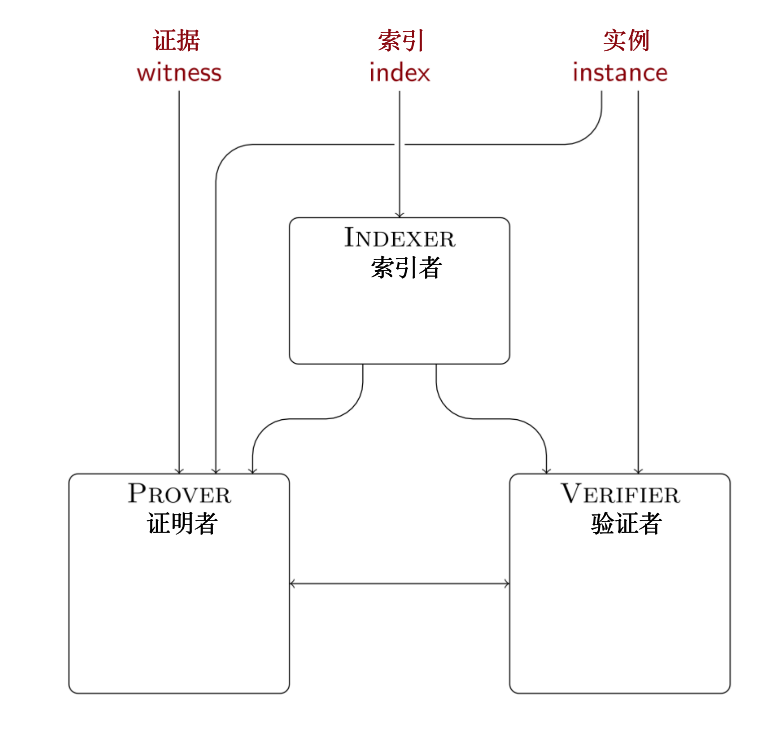

# 📃 STARK 算法解析（第 6 部分: 加速整个流程）

本教程的前一部分提出了数学层面的改进是否可以减少 STARK 算法的运行时间的问题。事实上，他们可以！有一些独立于 STARK 机制的传统代数计算技巧，以及一些专门针对交互式证明系统的技术。

# 1. 数论变换（ NTT ）及其应用
## 1.1 快速傅立叶变换
定义 $$f(X)$$ 是一个阶最多为 $$2^k-1$$ 的多项式，其系数为复数。计算 $$f(X)$$ 在 $$2^k$$ 个复数单位根上分别求值的最有效方法是什么？具体来说，定义 $$\omega = e^{2 \pi i / 2^k}$$，那么该算法的输出应该是

<center>$$(f(\omega^i))_{i=0}^{2^k-1} = (f(1), f(\omega), f(\omega^2), \ldots, f(\omega^{2^k-1}))$$</center>

天真的解决方案是依次、单独计算每个求值结果。一个更聪明的解决方案依赖于这样的观察： 

$$f(\omega^i) = \sum_{j=0}^{2^k-1} \omega^{ij} f_j$$，并将偶数项 <font color="708090">（**E**ven）</font>与奇数项<font color="708090">（**O**dd）</font>拆开，得到：

$$f(\omega^i) = \sum_{j=0}^{2^{k-1}-1} \omega^{i(2j)}f_{2j} + \sum_{j=0}^{2^{k-1}-1} \omega^{i(2j+1)} f_{2j+1} $$

$$ = \sum_{j=0}^{2^{k-1}-1} \omega^{i(2j)}f_{2j} + \omega^i \cdot \sum_{j=0}^{2^{k-1}-1} \omega^{i(2j)} f_{2j+1} $$

$$ = f_E(\omega^{2i}) + \omega^i \cdot f_O(\omega^{2i}) $$

其中，$$f_E(X)$$ 和 $$f_O(X)$$ 分别表示 $$f(X)$$ 中系数为偶数、奇数的多项式。

换句话说，$$f(X)$$ 在 $$\omega^i$$ 处的求值可以用 $$f_E(X)$$ 和 $$f_O(X)$$ 在 $$\omega^{2i}$$ 的求值形式来描述。对于一批点 $$\lbrace\omega^{ij}\rbrace_ {j=0}^{2^k-1}$$ 也是如此，在这种情况下，只需要 $$f_E(X)$$ 和 $$f_O(X)$$ 在一半大小的域上的值：$$\lbrace(\omega^{ij})^2\rbrace_ {j=0}^{2^k-1} = \lbrace(\omega^{2i})^j\rbrace_ {j=0}^{2^{k-1}-1}$$。请注意，批量对 $$f_E(X)$$ 和 $$f_O(X)$$ 求值的任务是一半大小的独立任务。这就是分治法！具体来说，如下策略所示：

- 将系数向量分成偶数和奇数部分；
- 通过递归，在 $$\lbrace(\omega^{2i})^j\rbrace_{j=0}^{2^{k-1}-1}$$ 上对 $$f_E(X)$$ 求值；
- 通过递归，在 $$\lbrace(\omega^{2i})^j\rbrace_{j=0}^{2^{k-1}-1}$$ 上对 $$f_O(X)$$ 求值；
- 通过公式：$$f(\omega^i) = f_E(\omega^{2i}) + \omega^i \cdot f_O(\omega^{2i})$$，将求值向量合并

没错！这就是快速傅里叶变换（FFT）。之所以需要第 $$2^k$$ 个单位根，是因为它保证了 $$\lbrace(\omega^{ij})^2\rbrace_ {j=0}^{2^k-1} = \lbrace(\omega^{2i})^j\rbrace_ {j=0}^{2^{k-1}-1}$$，因此递归实际上是在一个一半大小的域上。换句话说，如果你用类似的策略在 $$\lbrace z^j\rbrace_{j=0}^{2^k-1}$$ 中对 $$f(X)$$ 求值，其中 $$z$$ 不是第 $$2^k$$ 个本原单位根，那么求值域不会随着每个递归步骤而缩小。有 $$k$$ 个递归步骤，每一个都有 $$2^k$$ 个乘法和加法，所以这个算法的复杂度是 $$O(2^k \cdot k) $$，或者用系数向量 $$N = 2^k$$ 的长度表示，是 $$O(N \cdot \log N)$$。这比天真的顺序求值算法的复杂度 $$O(N^2)$$ 快得多。

请注意，我们需要 $$\omega$$ 拥有的唯一属性是，平方集合 $$\lbrace\omega^j\rbrace_{j=0}^{2^k-1}$$ 是一个大小为一半的集合。数字 ω 满足这个属性，因为 $$\omega^{2^{k-1}+i} = -\omega^i$$。重要的是，只要它满足这个属性，ω 不需要是一个复数。事实上，只要一个有限域有一个阶为 $$2^k$$ 的子群，这个子群是由某个 $$\omega$$ 产生，那么可以用相同的方式使用这个 $$\omega$$。由此产生的算法是 FFT 在有限域的类似算法，有时被称为数论变换（NTT）。


```python
def ntt( primitive_root, values ):
    assert(len(values) & (len(values) - 1) == 0), "cannot compute ntt of non-power-of-two sequence"
    if len(values) <= 1:
        return values
        
    field = values[0].field
    
    assert(primitive_root^len(values) == field.one()), "primitive root must be nth root of unity, where n is len(values)"
    assert(primitive_root^(len(values)//2) != field.one()), "primitive root is not primitive nth root of unity, where n is len(values)"

    half = len(values) // 2

    odds = ntt(primitive_root^2, values[1::2])
    evens = ntt(primitive_root^2, values[::2])

    return [evens[i % half] + (primitive_root^i) * odds[i % half] for i in range(len(values))]
```

当我们应用 FFT（或 NTT ）两次，但在第二层使用 $$\omega$$ 的逆元时，就会感受到神奇的“魔法”。具体来说，如果我们把求值列表当作一个多项式系数的列表，并以相反的顺序对这个多项式在第 $$2^k$$ 个单位根上求值时，会发生什么？

回顾一下，傅里叶变换的第 $$i$$ 个系数是 $$f(\omega^i) = \sum_{j=0}^{2^k-1} f_j \omega^{ij}$$。所以双重傅里叶变换的第 $$l$$ 个系数是

<center>$$\sum_{i=0}^{2^k-1} f(\omega^i) \omega^{-il} = \sum_{i=0}^{2^k-1} \left( \sum_{j=0}^{2^k-1} f_j \omega^{ij} \right)  \omega^{-il}  = \sum_{j=0}^{2^k-1} f_j \sum_{i=0}^{2^k-1} \omega^{i(l-j)} $$。</center>

只要 $$l-j \neq 0$$，$$\sum_{i=0}^{2^k-1} \omega^{i(l+j)}$$ 就会“消失”。想要明白这一点，请回忆一下，对于所有的 $$i$$，都有 $$\omega^{2^{k-1} + i} = -\omega^i$$，所以这个“和”中的每一项都有一个相等的相反项来抵消它。所以在上面的公式中，唯一被乘以“非零和”的系数 $$f_j$$ 是 $$f_l$$，而事实上这个“和”是 $$\sum_{i=0}^{2^k-1}1 = 2^k$$。所以综上所述，$$\mathbf{f}$$ 的双重傅里叶变换的第 $$l$$ 个系数为 $$2^k \cdot f_{l}$$，这与 $$\mathbf{f}$$ 的第 $$l$$ 个系数相同，但缩放了 $$2^k$$ 倍。

所得出的是一个逆快速傅里叶变换（IFFT）。具体来说，这个逆是与常规快速傅里叶变换相同的，除了：
- 它使用 $$\omega^{-1}$$ 而不是 $$\omega$$；
- 它需要在每个系数上撤销缩放系数 $$2^k$$。
  
同样的，不需要对该逻辑做任何改变，即可适用于含有阶为 $$2^k$$ 的子群的有限域，结果是逆 NTT。

```python
def intt( primitive_root, values ):
    assert(len(values) & (len(values) - 1) == 0), "cannot compute intt of non-power-of-two sequence"

    if len(values) == 1:
        return values

    field = values[0].field
    ninv = FieldElement(len(values), field).inverse()

    transformed_values = ntt(primitive_root.inverse(), values)
    return [ninv*tv for tv in transformed_values]
```


## 1.2 快速多项式算术
NTT 在计算机代数中很流行，因为傅里叶变换对多项式和它们的值具有同态性。具体来说，多项式的乘法对应于其傅里叶变换的“对应元素逐元相乘”。为了证明这一点，请将傅里叶变换的公式应用于乘积多项式的公式。想明白为什么上述成立，请记住，傅里叶变换代表了多项式的求值。很明显，$$h(X) = f(X) \cdot g(X)$$ 在任何一个点上$$z$$的求值结果，都是 $$f(X)$$ 和 $$g(X)$$ 在 $$z$$ 点的求值的乘积。只要 $$\mathsf{deg}(h(X)) < 2^k$$，我们就可以通过以下方式计算这个乘积：

- 计算 NTT
- 将得到的向量“对应元素逐元相乘”
- 计算逆 NTT

```python
def fast_multiply( lhs, rhs, primitive_root, root_order ):
    assert(primitive_root^root_order == primitive_root.field.one()), "supplied root does not have supplied order"
    assert(primitive_root^(root_order//2) != primitive_root.field.one()), "supplied root is not primitive root of supplied order"

    if lhs.is_zero() or rhs.is_zero():
        return Polynomial([])

    field = lhs.coefficients[0].field
    root = primitive_root
    order = root_order
    degree = lhs.degree() + rhs.degree()

    if degree < 8:
        return lhs * rhs

    while degree < order // 2:
        root = root^2
        order = order // 2

    lhs_coefficients = lhs.coefficients[:(lhs.degree()+1)]
    while len(lhs_coefficients) < order:
        lhs_coefficients += [field.zero()]
    rhs_coefficients = rhs.coefficients[:(rhs.degree()+1)]
    while len(rhs_coefficients) < order:
        rhs_coefficients += [field.zero()]

    lhs_codeword = ntt(root, lhs_coefficients)
    rhs_codeword = ntt(root, rhs_coefficients)

    hadamard_product = [l * r for (l, r) in zip(lhs_codeword, rhs_codeword)]

    product_coefficients = intt(root, hadamard_product)
    return Polynomial(product_coefficients[0:(degree+1)])
```

快速乘法是很多快速多项式算术算法的基础。本教程特别感兴趣的是*“归零多项式”*的计算——在一个被称为*“求值域”*的给定点列表上“消失”（求值为零）的多项式。想要完成“归零多项式”的计算，我们可以采用“分治法”：
- 将求值域划分为两个相等的部分
- 分别计算这两部分的“归零多项式”
- 使用快速乘法将“归零多项式”相乘

```python
def fast_zerofier( domain, primitive_root, root_order ):
    assert(primitive_root^root_order == primitive_root.field.one()), "supplied root does not have supplied order"
    assert(primitive_root^(root_order//2) != primitive_root.field.one()), "supplied root is not primitive root of supplied order"

    if len(domain) == 0:
        return Polynomial([])

    if len(domain) == 1:
        return Polynomial([-domain[0], primitive_root.field.one()])

    half = len(domain) // 2

    left = fast_zerofier(domain[:half], primitive_root, root_order)
    right = fast_zerofier(domain[half:], primitive_root, root_order)
    return fast_multiply(left, right, primitive_root, root_order)
```

另一项受益于快速乘法的任务是在任意域中的批量求值（且不说快速“归零多项式”计算）。该算法背后的思想是将给定的多项式逐步约简到一个新的多项式，新的多项式在域的一个子集上取相同的值。这里术语“约简”不是一个比喻——它通过模除域的“归零多项式”从而实现的多项式化简。所以这就产生了另一个分治法：

- 将域划分为两部分，即左边和右边；
- 计算每一部分的“归零多项式”；
- 将多项式模除左“归零多项式”与右“归零多项式”；
- 批量求左半域左余数和右半域右余数
- 拼接求值向量
  
请注意，由另一种分治算法计算的“归零多项式”的使用顺序与产生它们的顺序相反。一个稍微复杂一些的算法利用记忆化来提高性能。

```python
def fast_evaluate( polynomial, domain, primitive_root, root_order ):
    assert(primitive_root^root_order == primitive_root.field.one()), "supplied root does not have supplied order"
    assert(primitive_root^(root_order//2) != primitive_root.field.one()), "supplied root is not primitive root of supplied order"

    if len(domain) == 0:
        return []

    if len(domain) == 1:
        return [polynomial.evaluate(domain[0])]

    half = len(domain) // 2

    left_zerofier = fast_zerofier(domain[:half], primitive_root, root_order)
    right_zerofier = fast_zerofier(domain[half:], primitive_root, root_order)

    left = fast_evaluate(polynomial % left_zerofier, domain[:half], primitive_root, root_order)
    right = fast_evaluate(polynomial % right_zerofier, domain[half:], primitive_root, root_order)

    return left + right
```

现在让我们来看看求值的相对步骤——多项式插值。理想情况下，我们希望应用另一种分治的策略，但这很棘手。我们可以将点的集合分成两部分，并找到每部分的插值多项式，但接下来如何将它们结合起来？

找到“通过左半边点，并在右半边点的 x 坐标上取值为 0”的多项式，反之亦然，如何？这当然是一种改进方法，因为将它们相加就能得到所需的插值多项式。然而，这不再是一个分治法，因为在一次递归之后，问题的大小仍然是一样的。

如果我们对左半边点插值出一个多项式，然后乘以右半边 x 坐标的“归零多项式”，会怎么样？接近了，差一点就要成功了：“归零多项式”在左边的 x 坐标上取不同于 1 的值，这意味着乘法会破坏嵌入在左边插值多项式中的信息。

但是右边的“归零多项式”在左边 x 坐标上的值不是随机的，可以通过计算右边的“归零多项式”并在左边 x 坐标上进行批量求值来预测。需要做的是找到通过点的多项式，这些点的 x 坐标对应于左半边的点，而其 y 坐标将要乘以“归零多项式”。这些只是左边的 y 坐标，除以右边“归零多项式”在匹配的 x 坐标上的值。

```python
def fast_interpolate( domain, values, primitive_root, root_order ):
    assert(primitive_root^root_order == primitive_root.field.one()), "supplied root does not have supplied order"
    assert(primitive_root^(root_order//2) != primitive_root.field.one()), "supplied root is not primitive root of supplied order"
    assert(len(domain) == len(values)), "cannot interpolate over domain of different length than values list"

    if len(domain) == 0:
        return Polynomial([])

    if len(domain) == 1:
        return Polynomial([values[0]])

    half = len(domain) // 2

    left_zerofier = fast_zerofier(domain[:half], primitive_root, root_order)
    right_zerofier = fast_zerofier(domain[half:], primitive_root, root_order)

    left_offset = fast_evaluate(right_zerofier, domain[:half], primitive_root, root_order)
    right_offset = fast_evaluate(left_zerofier, domain[half:], primitive_root, root_order)

    if not all(not v.is_zero() for v in left_offset):
        print("left_offset:", " ".join(str(v) for v in left_offset))

    left_targets = [n / d for (n,d) in zip(values[:half], left_offset)]
    right_targets = [n / d for (n,d) in zip(values[half:], right_offset)]

    left_interpolant = fast_interpolate(domain[:half], left_targets, primitive_root, root_order)
    right_interpolant = fast_interpolate(domain[half:], right_targets, primitive_root, root_order)

    return left_interpolant * right_zerofier + right_interpolant * left_zerofier
```

接下来是：在陪集上快速求值。在 STARK 流程图中，当把多项式转化为码字输入到 FRI 时，就需要这项任务。在任意域上使用快速批量求值方法可以解决这一问题。然而，当给定的域与阶为$$2^k$$的陪集重合时，不直接使用 NTT 将是一件憾事。唯一的问题是如何转换求值域，这正是多项式缩放所能做到的事。

```python
def fast_coset_evaluate( polynomial, offset, generator, order ):
    scaled_polynomial = polynomial.scale(offset)
    values = ntt(generator, scaled_polynomial.coefficients + [offset.field.zero()] * (order - len(polynomial.coefficients)))
    return values
```

对陪集的快速求值使我们能够回答在将快速乘法过程调整为除法而不是乘法时出现的棘手问题。快速乘法对码字进行逐元乘法，快速除法对码字进行逐元除法，这些码字都是通过对多项式的系数向量使用 NTT 得到的。当除数的码字在某个位置为零时，会发生什么呢？如果分子码字在该位置不为零，那么除法就会产生非零余数，整个操作就会被标记为错误。但是，如果分子在给定的位置上也是零的话，仍然可以进行“干净”的除法。朴素的快速除法算法由于零除以零错误而失败，即使基础多项式产生了干净的除法。这正是在尝试使用 NTT 除以“归零多项式”时出现的问题。我们在教程的前一部分中通过使用多项式长除法解决了这个问题，但是这个解决方案的运行时间是二次的。我们想要准线性的！

解决方法是对在NTT定义的群上的陪集上求值产生的码字进行逐元除法。具体来说，这个过程包括五个步骤：

- 扩大规模
- NTT
- 逐元除法
- 逆 NTT
- 恢复规模

这个解决方案只有在分母多项式在陪集上没有任何零值时才有效。然而，在某些情况下（如除掉“归零多项式”），分母在特殊的陪集上已知没有零值。

python 代码有很多处理特殊情况的模板，但最后都归结为这五个步骤。

```python
def fast_coset_divide( lhs, rhs, offset, primitive_root, root_order ): # clean division only!
    assert(primitive_root^root_order == primitive_root.field.one()), "supplied root does not have supplied order"
    assert(primitive_root^(root_order//2) != primitive_root.field.one()), "supplied root is not primitive root of supplied order"
    assert(not rhs.is_zero()), "cannot divide by zero polynomial"

    if lhs.is_zero():
        return Polynomial([])

    assert(rhs.degree() <= lhs.degree()), "cannot divide by polynomial of larger degree"

    field = lhs.coefficients[0].field
    root = primitive_root
    order = root_order
    degree = max(lhs.degree(),rhs.degree())

    if degree < 8:
        return lhs / rhs

    while degree < order // 2:
        root = root^2
        order = order // 2

    scaled_lhs = lhs.scale(offset)
    scaled_rhs = rhs.scale(offset)
    
    lhs_coefficients = scaled_lhs.coefficients[:(lhs.degree()+1)]
    while len(lhs_coefficients) < order:
        lhs_coefficients += [field.zero()]
    rhs_coefficients = scaled_rhs.coefficients[:(rhs.degree()+1)]
    while len(rhs_coefficients) < order:
        rhs_coefficients += [field.zero()]

    lhs_codeword = ntt(root, lhs_coefficients)
    rhs_codeword = ntt(root, rhs_coefficients)

    quotient_codeword = [l / r for (l, r) in zip(lhs_codeword, rhs_codeword)]
    scaled_quotient_coefficients = intt(root, quotient_codeword)
    scaled_quotient = Polynomial(scaled_quotient_coefficients[:(lhs.degree() - rhs.degree() + 1)])

    return scaled_quotient.scale(offset.inverse())
```

# 2. 快速“归零多项式”求值

上述算法主要适用于证明者，其复杂性从 $$O(T^2)$$ 降到了 $$O(T \log T)$$。证明者的可扩展性已经实现。验证者的瓶颈是对状态转移“归零多项式”的求值，一般来说，这是一个稠密的阶数为 $$T$$ 的多项式。因此，基本上 $$T$$ 个系数可能是非零的，由于验证者必须接触所有的系数以计算多项式的值，他的运行时间将是相同数量级的。对于可扩展的验证者，我们希望运行时间低于 $$\tilde{O}(\log T)$$。有两种方法可以实现这一点：基于群论的稀疏“归零多项式”，以及预处理的稠密“归零多项式”。

## 2.1 基于群论的稀疏“归零多项式”

群论的一个基本事实是：每一个元素求幂到它的阶数时都会得到单位元。例如，有限域 $$\mathbb{F}_ p \backslash \lbrace 0 \rbrace$$ 的乘法群的一个阶为 $$r$$ 的子群中的一个元素 $$x$$，满足 $$x^r = 1$$。重新排列，用一个正式的未定元 $$X$$ 来替换 $$x$$，我们得到一个多项式 $$X^r-1$$，这个多项式保证在阶为 $$r$$ 的子群中的每一个元素上求值都为 0。此外，这个多项式是首一多项式（即最高项系数为 1），并且是阶最小的（在所有 $$r$$ 个点上都消失的所有多项式中）。因此，这个稀疏多项式恰恰是子群的“归零多项式”！

对于 STARKs，我们已经在使用有限域，它伴随有阶为 $$2^k$$ 的子群（对于许多 $$k$$ 都成立）。因此，如果执行轨迹在$$\lbrace \omicron^i \, \vert \, 0 \leq i < 2^k \rbrace$$（$$\omicron$$ 是 $$2^k$$ 阶子群的生成元）中被插值，那么 $$\lbrace \omicron^i \, \vert \, 0 \leq i < 2^k - 1\rbrace$$ 的“归零多项式”等于在所有 $$X$$ 点的有理式 $$\frac{X^{2^k-1} - 1}{X - \omicron^{-1}}$$，除了 $$X = \omicron^{-1}$$ 点，在此点有理式未定义。

验证者显然不会进行除法，因为除法将稠密的多项式变成了稀疏的多项式。相反，验证者对分子进行稀疏求值，并将其除以分母的值。只要验证者不需要在 $$\omicron^{-1}$$ 点对“归零多项式”进行求值就可以了，这正是 FRI 的陪集技巧所保证的。

要应用此方法，STARK 的轨迹长度必须是 2 的幂。如果轨迹与 2 的幂相差甚远，比如差 $$d$$，那么验证者需要对一个分母中有 $$d-1$$ 个因子的“归零多项式”求值。换句话说，轨迹长度必须是 2 的幂，以使验证者更快。 

解决方法是填充轨迹，直到它的长度是 2 的下一次方。显然，这种填充必须与状态转移约束兼容，以便组合多项式在阶为 2 的幂次方的子群的所有点（除了一点）上求值结果仍然为零。 自然的解决方案是对 2 的幂次方个周期，应用相同的状态转移函数，并让边界条件指向周期索引在中间某处的 "输出"。然而，当涉及到为泄露零知识而将随机化生成器附加到轨迹中时，这一设计决策将导致一个问题。

- 如果随机化生成器是在填充轨迹之后附加的，那么随机化的轨迹就不适用于阶为 2 的幂次方的子群。在这种情况下，必须计算插值多项式：
  - 在阶为 2 的幂次方的子群上，它被求值为执行轨迹；
  - 在一个不同的域上，它被求值为均匀随机的随机化生成器。
- 如果随机化生成器是在填充前添加的，那么状态转移约束必须与该操作兼容，否则在整个阶为 2 的幂次方的子群中，组合多项式将不会求值为零。这个选项需要改变 AIR。
  
## 2.1 预处理
标准的多项式 IOP 由两方组成，即证明者和验证者，预处理多项式 IOP 由三方组成：证明者、验证者和索引者。(索引者有时也被称为预处理者或*协助者*）。

索引者的作用是执行有助于验证者（更不用说证明者）的计算，这些计算对于验证者来说太复杂、昂贵了，无法直接执行。问题是，索引者并没有收到与验证者相同的输入。索引器的输入（*索引*）是关于计算的信息，在具体数据被知道之前可以提前计算。例如，索引可以是计算应当需要的周期数，以及状态转移约束。关于计算的具体信息（或*实例*），将是边界约束。验证者的输入以及索引者的输出（其本身可能包括索引）都是实例。关键是，从验证者的角度来看，索引者的输出是可信的。

<center></center>

STARKs 的正式定义并不包括有预处理的证明系统，当把索引者的工作算作验证者的工作时，一个有预处理的证明系统可以说是不可扩展的。然而，如果验证者的工作（不包括索引者的工作）在计算规模上是多项式对数的，那么预处理的证明系统在英语意义上是可扩展的。

## 2.2 预处理的稠密“归零多项式”

具体来说，索引者给验证者的输出将是对“归零多项式” $$Z(X) = \prod_{i=0}^{T-1} (X-\omicron^i)$$ 的一个承诺，这个承诺是通过熟悉的 Reed-Solomon 码字结构的 Merkle 根的形式给出的。每当验证者需要“归零多项式”在某个点上的值时，证明者会向他提供这个叶子节点和一个认证路径。请注意，验证者不需要在 FRI 域外的点上对这个“归零多项式”求值。因此，不需要证明这个“归零多项式”是低阶的；这直接来自于可信的索引者。

这一描述突出了使用预处理来实现可扩展性的主要缺点：证明更大，因为它包括更多的 Merkle 认证路径。另一个缺点是稍强的安全模型：验证者需要信任索引者的输出。即使这里的预处理是透明的，但为了证明这种信任而重新运行索引者的工作可能是过于昂贵的。本教程的附录代码通过预处理实现了可扩展性，而不是通过群论。

## 2.3 可变的执行时间

如果预先知道执行时间 $$T$$，上面描述的解决方案就可以顺利实施。但是，当执行时间事先不知道，因此不能包含在索引中时，该怎么办呢?

预处理仍然拥有一个解决方案，但代价是验证者的成本略高。索引者对“归零多项式”族 $${Z_ {2^k}(X)}_ k$$ 的每个成员提交承诺，其中 $$Z_{2^k}(X) = \prod_{i=0}^{2^k-1} (X - \omicron^i)$$。定义 $$t = \lfloor \log_2 T \rfloor$$，这样 $$Z_{2^t}(X)$$ 就属于这个族。

证明者希望证明某个状态转移多项式 $$p(X)$$ 在 $${\omicron^i}_ {i=0}^{T-1}$$ 上求值为零。在没有预处理的情况下，他将承诺并证明一个商式多项式 $$q(X) = p(X) / Z_{T-1}(X)$$ 的阶的有界性，其中 $$Z_{T-1}(X) = \prod_{i=0}^{T-1} (X - \omicron^i)$$。通过预处理，他必须承诺并证明两个商式多项式的阶的有界性：

1. $$q_l(X) = \frac{p(X) }{ Z_{2^t}(X)}$$
2. $$q_r(X) = \frac{p(X) }{\omicron^{T-1-2^t} \cdot Z_{2^t}(\omicron^{2^t-T+1} \cdot X)}$$
   
第二个多项式的分母正好是“归零多项式” $$\prod_{i=T-1-2^t}^{T-1} (X - \omicron^i)$$。当且仅当状态转移多项式能被联合“归零多项式” $$\prod_{i=0}^{T-1} (X - \omicron^i)$$ 除尽时，它才能被两个“归零多项式”除尽。

虽然这个解决方案在一般情况下已经能充分工作，但对于 Rescue-Prime 计算，周期数是已知的。因此，该实现方案反映了这种设定。

# 3.  快速 STARKs
现在是时候应用所开发的工具，使 STARK 算法更加高效。

首先，添加一个预处理函数。这个函数是 STARK 类的一个成员，可以访问它的字段（比如周期数）。它产生两个输出：一个给证明者，另一个给验证者。在这个具体案例中，证明者收到了“归零多项式”和“归零多项式”码字，而验证者收到了“归零多项式”的 Merkle 根。

```python
# class FastStark:
# [...]
    def preprocess( self ):
        transition_zerofier = fast_zerofier(self.omicron_domain[:(self.original_trace_length-1)], self.omicron, len(self.omicron_domain))
        transition_zerofier_codeword = fast_coset_evaluate(transition_zerofier, self.generator, self.omega, self.fri.domain_length)
        transition_zerofier_root = Merkle.commit(transition_zerofier_codeword)
        return transition_zerofier, transition_zerofier_codeword, transition_zerofier_root
```

`prove` 和 `verify` 的参数列表必须做相应的调整。

```python
# class FastStark:
# [...]
    def prove( self, trace, transition_constraints, boundary, transition_zerofier, transition_zerofier_codeword, proof_stream=None ):
# [...]
    def verify( self, proof, transition_constraints, boundary, transition_zerofier_root, proof_stream=None ):
```

证明者可以使用快速陪集除法来除掉状态转移“归零多项式”，并注意到这个分母正好是参数。

```python
# class FastStark:
#     [...]
#     def prove( [..] ):
#       [...]
        # divide out zerofier
        transition_quotients = [fast_coset_divide(tp, transition_zerofier, self.generator, self.omicron, self.omicron_domain_length) for tp in transition_polynomials]
```

验证者需要在一些地方执行这种除法，这意味着验证者需要“归零多项式”在这些地方的值。因此，证明者必须提供它们，也就是认证路径。

```python
# class FastStark:
#     [...]
#     def prove( [..] ):
#       [...]
        # ... and also in the zerofier!
        for i in quadrupled_indices:
            proof_stream.push(transition_zerofier_codeword[i])
            path = Merkle.open(i, transition_zerofier_codeword)
            proof_stream.push(path)
```

反过来，验证者需要从证明流中读取这些值及其认证路径，然后验证认证路径，并将“归零多项式”的值存储在一个结构中供以后使用。请注意，这些认证路径是针对 Merkle 根进行验证的，Merkle 根对于验证者来说是一个新输入。

```python
# class FastStark:
#     [...]
#     def verify( [..] ):
#       [...]
        # read and verify transition zerofier leafs
        transition_zerofier = dict()
        for i in duplicated_indices:
            transition_zerofier[i] = proof_stream.pull()
            path = proof_stream.pull()
            verifier_accepts = verifier_accepts and Merkle.verify(transition_zerofier_root, i, path, transition_zerofier[i])
            if not verifier_accepts:
                return False
```

那么最后，当非线性组合被计算出来后，这些值就可以从内存中读出并使用。

```python
# class FastStark:
#     [...]
#     def verify( [..] ):
#       [...]
                quotient = tcv / transition_zerofier[current_index]
```

现在，剩下的就是在预处理的范围之外切换到快速多项式算术。第一个机会是对轨迹进行插值。

```python
# class FastStark:
#     [...]
#     def prove( [..] ):
#         [...]
            trace_polynomials = trace_polynomials + [fast_interpolate(trace_domain, single_trace, self.omicron, self.omicron_domain_length)]
```

下一步：在对边界商式承诺时，使用快速陪集求值。随机化生成器多项式以及组合多项式的承诺也是如此。

```python
# class FastStark:
#     [...]
#     def prove( [..] ):
        # [...]
        # commit to boundary quotients
        # [...]
        for s in range(self.num_registers):
            boundary_quotient_codewords = boundary_quotient_codewords + [fast_coset_evaluate(boundary_quotients[s], self.generator, self.omega, self.fri_domain_length)]
            merkle_root = Merkle.commit(boundary_quotient_codewords[s])
            proof_stream.push(merkle_root)
        # [...]
        # commit to randomizer polynomial
        randomizer_polynomial = Polynomial([self.field.sample(os.urandom(17)) for i in range(self.max_degree(transition_constraints)+1)])
        randomizer_codeword = fast_coset_evaluate(randomizer_polynomial, self.generator, self.omega, self.fri_domain_length)
        randomizer_root = Merkle.commit(randomizer_codeword)
        proof_stream.push(randomizer_root)
        # [...]
        # compute matching codeword
        combined_codeword = fast_coset_evaluate(combination, self.generator, self.omega, self.fri_domain_length)
```

除以状态转移“归零多项式”是一项相当繁重的任务。改用基于 NTT 的除法是值得的。请注意，这里需要进行陪集除法，因为在轨迹域的各点上，“归零多项式”的取值肯定都为零。

```python
 # divide out zerofier
        transition_quotients = [fast_coset_divide(tp, transition_zerofier, self.generator, self.omicron, self.omicron_domain_length) for tp in transition_polynomials]
```

最后，对于 FRI 验证者，将缓慢的拉格朗日插值换成快得多的基于（陪集）NTT 的插值。

```python
# class Fri:
    # [...]
    # def verify( [..] ):
        # [...]
        # compute interpolant
        last_domain = [last_offset * (last_omega^i) for i in range(len(last_codeword))]
        coefficients = intt(last_omega, last_codeword)
        poly = Polynomial(coefficients).scale(last_offset.inverse())
```

在修改了 Rescue-Prime 签名方案以使用新的 `FastStark` 类和方法后，产生了一个明显更快的签名方案：
- 私钥大小：16 字节（耶！）
- 公钥大小：16 字节（耶！）
- 签名大小：**~160 kB**
- 密钥生成时间：0.01 秒 （可接受的）
- 签名时间：**72 秒**
- 验证时间：**8 秒**

这样的改进如何？由于有更多的 Merkle 路径与“归零多项式”叶子节点相关联，证明的大小更大了，但作为交换，验证的速度也快了一个数量级。当然，还可以进行进一步的改进，但这些都超出了本教程的教学范围，留给读者作为练习。

[0](index.md) - [1](overview.md) - [2](basic-tools.md) - [3](fri.md) - [4](stark.md) - [5](rescue-prime.md) - **6**