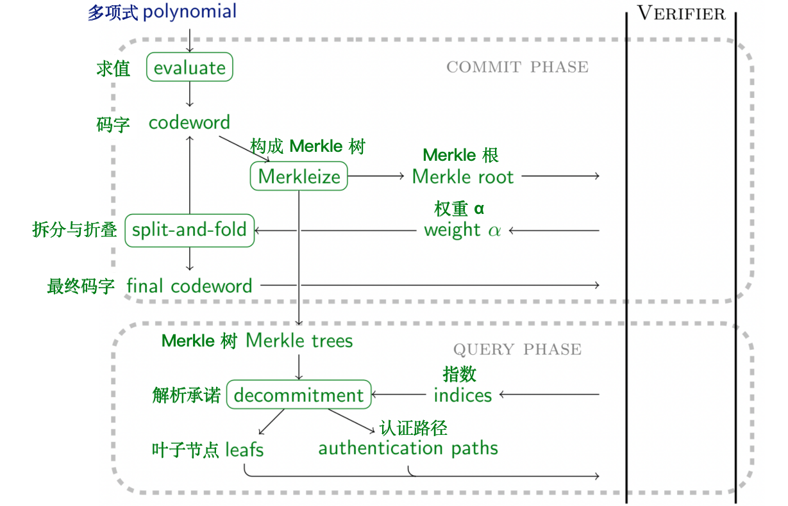
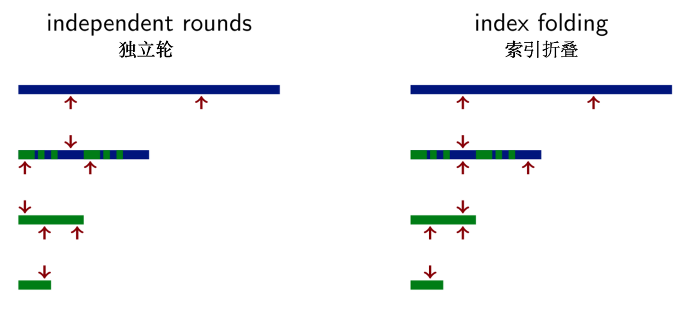

# 📃 STARK 算法解析（第 3 部分: FRI）
FRI 是一个确定“承诺”多项式具有有界度<font color="708090">（bounded degree，这里尤指度上限）</font>的协议。FRI 是* Fast Reed-Solomon IOP of Proximity* 的缩写，其中 IOP 代表交互式预言机证明。FRI 是以码字的语言呈现的：证明者向验证者发送一些码字，验证者并不完全阅读这些码字，而是进行预言机-查询<font color="708090">（oracle-queries ）</font>，读取这些码字的特定位置。该协议使用的码字是 *Reed-Solomon 码字*，它们的值对应于某个低阶多项式在域 $$D$$ 点列表上的求值结果。这个点列表的长度大于多项式中可能存在的非零系数的数量，两者之间差了一个因子，这个因子被称为*扩展因子（或膨胀因子）*，它是码率 $$\rho$$ 的倒数。

由于码字代表低阶多项式，而且在现实世界开发中，码字都隐藏在 Merkle 树背后，因此，从多项式承诺方案的角度来介绍 FRI 是比较自然的，但有一些需要注意的地方。进行以下两种区分是有科学价值的：1）将码字的类型与 IOP 区分，2）将上述两者与模拟预言机的 Merkle 树区分。然而，从可行性的角度看，最好将上述三者看作一个基本原语的三个组成部分，该基本原语与多项式承诺方案有关。在本教程的后续部分，我们将在此意义上使用 FRI 这个术语。

在一个常规的多项式承诺方案中，证明者对多项式 $$f(X)$$ 进行承诺，该承诺后续将在给定的点 $$z$$ 上“打开”，使得证明者不能在两个不同的 $$f(z)$$ 值之间摇摆不定，该方案由三部分算法组成：

1. **commit**，从多项式中计算出一个“绑定”承诺；
2. **open**，产生一个证明：在给定 $$z$$ 上 $$f(z) = y$$ 成立，且多项式 $$f(X)$$ 与之前给出的承诺相匹配；
3. **verify**，验证由 **open** 算法产生的证明。

FRI 方案有一个不同的接口，但后一节将阐述它如何模拟标准多项式承诺方案的接口，同时也不会产生太多性能开销。FRI 是一个证明者和验证者之间的协议，它用于确定一个给定的码字属于一个低阶的多项式——“低”指的是最多为码字长度的 $$\rho$$ 倍。在不失一般性的前提下，证明者明确知道这个码字，而验证者只知道它的 Merkle 根和他选择的叶子节点，我们假设对某叶子节点认证路径的成功验证，认证路径可以确定此叶子节点属于这个 Merkle 树。
# 1. 拆分与折叠
近年来，证明系统的一个伟大的构想是*拆分和折叠* <font color="708090">*（split-and-fold）*</font>技术。该构想用来把一个断言约减为两个一半大小的断言，然后使用验证者提供的随机权重将两个断言合并成一个。经过在对数级数量的步骤后（与原始断言大小相比），当且仅当（除一些可忽略的安全降级外）原始断言是正确时，最后被缩减到一个微不足道大小的论断也是正确的。
在 FRI 的情况下，这个计算断言要求：给定的码字对应于一个低阶多项式。具体来说，$$N$$ 是码字的长度，$$d$$ 是它所对应的多项式的最大阶数<font color="708090">（笔者注：术语“对应”在这里被非正式地使用，以隐藏允许纠错码字与它们的生成多项式略有不同的情况。FRI 没有区分与给定域上的低阶多项式完全一致的码字，也没有区分在汉明距离上接近这种码字的多项式）</font>。设这个多项式为 $$f(X) = \sum_{i=0}^{d} c_i X^i$$。
按照快速傅里叶变换的分治法，这个多项式被分为偶数项<font color="708090">（**E**ven）</font>和奇数项<font color="708090">（**O**dd）</font>，即 $$f(X) = f_E(X^2) + X \cdot f_O(X^2)$$，其中$$f_E(X^2) = \frac{f(X) + f(-X)}{2} = \sum_{i=0}^{\frac{d+1}{2}-1} c_{2i} X^{2i}$$、$$f_O(X^2) = \frac{f(X) - f(-X)}{2X} = \sum_{i=0}^{\frac{d+1}{2}-1} c_{2i+1} X^{2i} $$。这种拆分是正确的，因为 $$f_E(X)$$ 中不存在奇数项了；$$f_O(X)$$ 中不存在偶数项了。该协议的关键步骤是，从 $$f(X)$$ 的码字中推导出 $$f^\star(X) = f_E(X) + \alpha \cdot f_O(X)$$ 的码字，其中 $$\alpha$$ 是一个由验证者提供的随机标量。

定义 $$D$$ 是域中乘法群的偶数阶 $$N$$ 的子群，利用 $$\omega$$ 生成这个子群：$$\langle \omega \rangle = D \subset \mathbb{F}_p \backslash\lbrace 0\rbrace$$。

定义 $$\lbrace f(\omega^i)\rbrace_{i=0}^{N-1}$$ 为 $$f(X)$$ 的码字，对应于在 $$D$$ 上的求值结果。定义 $$D^\star = \langle \omega^2 \rangle$$ 是另一个域，大小为 $$D$$ 的一半，并且定义 $$\lbrace f_ E(\omega^{2i})\rbrace_{i=0}^{N/2-1}$$、$$\lbrace f_ O(\omega^{2i})\rbrace_{i=0}^{N/2-1}$$、$$\lbrace f^\star(\omega^{2i})\rbrace_ {i=0}^{N/2-1}$$ 分别为 $$f_E(X)$$、$$f_O(X)$$、$$f^\star(X)$$ 分别在 $$D^\star$$ 上求值结果所对应的码字。

拓展 $$f^\star(X)$$ 的定义：$$\lbrace f^\star(\omega^{2i})\rbrace_{i=0}^{N/2-1} = \lbrace f_E(\omega^{2i}) + \alpha \cdot f_O(\omega^{2i})\rbrace_{i=0}^{N/2-1}$$；

再次拓展其定义，这一次利用 $$f_E(X^2)$$ 和 $$f_O(X^2)$$ 的定义进行拓展：$$\lbrace f^\star(\omega^{2i})\rbrace_{i=0}^{N/2-1}= \left\lbrace  \frac{f(\omega^i) + f(-\omega^i)}{2} + \alpha \cdot \frac{f(\omega^i) - f(-\omega^i)}{2 \omega^i} \right\rbrace_{i=0}^{N/2-1}= $$
$$ \lbrace  2^{-1} \cdot \left( ( 1 + \alpha \cdot \omega^{-i} ) \cdot f(\omega^i) + (1 - \alpha \cdot \omega^{-i} ) \cdot f(-\omega^i) \right) \rbrace_{i=0}^{N/2-1}$$

因为 $$\omega$$ 的阶数为 $$N$$ 则 $$\omega^{N/2} = -1$$，因此 $$f(-\omega^i) = f(\omega^{N/2 + i})$$。这种替换使我们清楚地看到，即使指数在一半的范围内迭代（从 $$ \space0\space$$ 到 $$\space N/2-1$$），所有 $$\lbrace f(\omega^i)\rbrace_{i=0}^{N-1}$$ 中的点都会在 $$\lbrace f^\star(\omega^{2i})\rbrace_{i=0}^{N/2-1}$$ 的推导过程中出现。后续的码字只有前者一半的长度这件事并不重要，重要的是多项式的阶数减半了。

此时是描述“一轮 FRI 协议”结构的好时候。证明者通过向验证者发送其码字的 Merkle 根来对 $$f(X)$$ 承诺，验证者回复一个“随机挑战”<font color="708090">（random challenge）</font> $$\alpha$$。证明者计算出 $$f^\star(X)$$ 并通过发送 $$\lbrace f^\star(\omega^{2i})\rbrace_{i=0}^{N/2-1}$$ 的 Merkle 根的方式对其进行承诺。

验证者现在获得了两个对多项式的承诺，验证者的任务是验证它们之间的关系是否正确。具体来说如果 $$f^\star(X) \neq 2^{-1} \cdot \left( (1 + \alpha X^{-1}) \cdot f(X) + (1 - \alpha X^{-1} ) \cdot f(-X) \right)$$（忽略左、右两边取值为 0 的情况），验证者应该拒绝这个证明。为了实现上述任务，验证者随机抽查一个索引 $$i \leftarrow{\text{\$}} \lbrace 0, \ldots, N/2-1\rbrace$$，其中定义了 3 个点：
- $$ A: (\omega^i, f(\omega^i))$$
- $$ B: (\omega^{N/2+i}, f(\omega^{N/2+i}))$$
- $$ C: (\alpha, f^\star(\omega^{2i}))$$
请注意，这里 A 和 B 的 x 坐标是 $$\omega^{2i}$$ 的平方根。在证明者收到来自验证者的索引 $$i$$ 后，证明者提供 y 坐标和它们的 Merkle 认证路径。验证者根据其正确的 Merkle 根来验证这些路径，并紧接着验证 A 、B 、C 三点在一条直线上。这个验证测试被称为*共线性检查*<font color="708090">*（colinearity check）*</font>。
为什么 A、B、C 三点在一条直线上呢？让我们首先找到通过 A、B 两点的直线，再看看这对于点 C 来说意味着什么。通过一个基本的拉格朗日插值法可以得到：
$$y = \sum_i y_i \prod_{j \neq i} \frac{x - x_j}{x_i - x_j} $$

$$= f(\omega^i) \cdot \frac{x - \omega^{N/2+i}}{\omega^{i} - \omega^{N/2+i}} + f(\omega^{N/2+i}) \cdot \frac{x - \omega^{i}}{\omega^{N/2+i} - \omega^{i}} $$

$$=  f(\omega^i) \cdot 2^{-1} \cdot \omega^{-i} \cdot (x + \omega^i) - f(\omega^{N/2+i}) \cdot 2^{-1} \cdot \omega^{-i} (x - \omega^i) $$

$$= 2^{-1} \cdot \left( (1 + x \cdot \omega^{-i}) \cdot f(\omega^i) + (1 - x \cdot \omega^i) \cdot f(\omega^{N/2 + i}) \right) \enspace$$
通过赋值 $$x = \alpha$$，我们得到了 C 的 y 坐标，即证明了 C 在通过 A、B 两点的直线上。
上述描述涵盖了协议的一轮，在该轮结束时，证明者和验证者又回到最初的起点。证明者希望确定一个给定的 Merkle 根“解承诺”为一个码字，且该码字定义的多项式有界。但有一个重要的区别：由于运行了一轮 FRI ，码字的长度以及多项式中可能非零系数的数量都减少了一半。证明者和验证者可以使用 $$f = f^\star$$，$$D = d^\star$$，并重复这一过程。在运行 $$\lceil \log_2 (d+1) \rceil - 1$$ 轮的 FRI 后（其中，$$d$$ 是原始多项式的阶数），证明者和验证者最终得到一个常数多项式，其码字也是常数。此时，证明者发送这个常数，<font color="708090">（笔者注：提前终止协议可能是有意义的，在这种情况下，证明者必须公开发送一个“非平凡”的码字，而验证者必须验证这个码字有一个有界的定义多项式。）</font>而不是码字的 Merkle 根，这清楚地表明它对应的是一个阶数为 0 的多项式。

<center></center>

在生产系统中，码字的长度往往不是通过 2 的倍数而是 2 的小次幂来减少的。这种优化减少了证明的大小，甚至可能同时改善运行时间。然而，本教程为简化起见，任何关于更高折叠系数的进一步分析都不在本教程讨论范围之内。

## 1.1 索引折叠
上述描述忽略了一个反直觉但非常微妙的问题：*随机索引*在各轮之间并不独立。相反，同一索引在全部轮次中被重复使用，在必要时用码字长度取模。

在每一轮中独立采样索引的安全性较低，原因是它很可能无法捕捉到混合码字，如下图所示：

<center></center>

蓝色码字与任何跟低阶多项式匹配的码字都相差甚远，而绿色码字确实与低阶多项式对应。为了从蓝色切换到绿色，恶意证明者在第二轮使用了一个混合码字。 这种混合码字基于随机选择的划分，是从一个码字或另一个码字中选择值来获得的。当所有共线性检查都涉及相同颜色的点时，恶意证明者就会成功。

当使用相同的索引时，该攻击就被阻止。混合码字必然会产生“不匹配颜色”的共线性测试——无论是在当前轮还是在下一轮。


## 1.2 直观上的安全性
多项式 $$f^\star(X^2)$$ 是 $$f(X)$$ 和 $$f(-X)$$ 的一个随机线性组合。 显然，如果证明者是诚实的，那么 $$f^\star(X)$$ 和它的码字满足这个关系。不太直观的是，当证明者利用比混合码字攻击更微妙的方式作恶时——什么样的共线性检查能使验证者注意到这种欺诈行为？

当验证者接受一个不对应于低阶多项式的码字时，欺诈的验证者就成功了。定义 $$\lbrace f(\omega^i)\rbrace_{i=0}^{N-1}$$ 是这样一个欺诈性的码字，对应于阶为 $$N-1$$ 的多项式 $$f(X)$$。那么 $$f_E(X)$$、$$f_O(X)$$ 以及它们的线性组合 $$f^\star(X) = f_E(X) + \alpha \cdot f_O(X)$$ 的阶数都最多为 $$N/2 - 1$$，此时，恶意证明者有两个选择：

1. 他诚实的通过在 $$L^\star = \langle \omega^2 \rangle$$ 上对 $$f^\star(X)$$ 求值，以计算出码字 $$\lbrace f^\star(\omega^{2i})\rbrace_{i=0}^{N/2-1}$$。这并没有帮助到他什么，虽然他现在不用“证明”一个长度为 $$N$$ 的码字对应于一个阶数小于 $$\rho \cdot N$$ 的多项式，但是他现在必须“证明”这个长度为 $$N/2$$ 的码字对应于一个阶数小于 $$\rho \cdot N/2$$ 的多项式。 没有理由认为这个错误的断言比他一开始提出的断言更容易证明。
2. 他发送了一个在 $$L^\star = \langle \omega^2 \rangle$$ 的足够多的点上求值结果都与 $$f^\star(X)$$ 不同的码字 $$\lbrace v_i\rbrace_{i=0}^{N/2-1}$$。这正是验证者的共线性检查所能暴露的欺诈类型。
   
直观地说，即使一个证明者在一个地方撒谎，也很难作弊，因为这是纠错码中的单个错误。码字的其他 $$N/2 - 1$$ 个值仍然能唯一地识别码字的定义多项式。一个作弊的证明者需要欺诈性的码字 $$\lbrace v_i\rbrace_{i=0}^{N/2-1}$$ 以对应阶数小于 $$\rho \cdot N/2$$ 的多项式。而要做到这一点，它需要在更多的点上与这个低阶多项式一致，而不仅仅是一个点。但是，随着恶意证明者不诚实的点数的增加，这种欺诈行为被共线性检查所揭露的概率也随之增加。

## 1.3 安全级别
对于 λ 比特的目标安全级别来说，需要多少次共线性检查呢？这是一个价值百万美元的问题。

[FRI 论文](https://eccc.weizmann.ac.il/report/2017/134/revision/1/download/)，[DEEP-FRI](https://sites.math.rutgers.edu/~sk1233/deep-fri.pdf) 的后续，以及[后续的后续](https://eprint.iacr.org/2020/654)，提出了一连串更精炼的论证，关键是依赖码率 $$\rho$$。 我并不假装理解这些证明，我将满足于仅仅复述 [EthSTARK 文档](https://eprint.iacr.org/2021/582) 中用于推测安全性的经验法则：<font color="708090">（笔者注：EthSTARK 文档还提供了一个更复杂的公式，说明在不依赖编码理论猜想时可证明达到的安全级别。）</font>
1. 用于建立 Merkle 树的哈希函数需要至少有 $$2\lambda$$ 个输出比特位。
2. 域中需要至少有 $$2\lambda$$ 个元素。（注意，这指的是用于 FRI 的域。特别的，如果域不够大，你也可以切换到一个扩域。）
3. 每一次共线性检查，你都会得到 $$\log_2 \rho^{-1}$$ 比特的安全性，因此，将共线性性检查的数量设定为 $$s = \lceil \lambda / \log_2 \rho^{-1} \rceil$$ 实现了 $$\lambda$$ 比特的安全性。

## 1.4 陪集 - FRI
到目前为止，对 FRI 协议的描述涉及到码字，码字定义为低阶多项式在给定求值域 $$D$$ 上的取值列表，其中 $$D$$ 是一个阶为 $$2^k$$ 的子群，其生成元为 $$\omega$$。在把 FRI 与 STARK 机制联系在一起时，将导致一系列问题。具体来说，STARK 协议也是通过 Reed-Solomon 码字来定义的。通过选择两个不相交的集合，来预见当求值点重合时可能出现的问题是值得的。

具体来说，定义新的求值域由一个阶数为 $$2^k$$ 的子群的一个陪集<font color="708090">*（coset）*</font>组成，利用某个不属于子群 $$\langle \omega \rangle,\cdot$$ 的元素 $$g$$ 作为偏移量<font color="708090">*（offset）*</font>。具体来说，$$D = \lbrace  g \cdot \omega^i \vert i \in \mathbb{Z}\rbrace$$，最简单直接的选择是设定 $$g$$ 是整个乘法群 $$\mathbb{F} \backslash \lbrace  0\rbrace, \cdot$$ 的一个生成元。下一个码字的求值域由以下 $$D$$ 的平方集合给出： $$D^\star = \lbrace  d^2 \vert d \in D\rbrace = \lbrace  g^2 \cdot \omega^{2i} \vert i \in \mathbb{Z}\rbrace$$

# 2. 具体实现
让我们在一个名为 `Fri` 的模块中实现上文所述算法。除了证明者和验证者的逻辑之外，它还有一些辅助方法来推导出轮数和初始求值域。

```python
import math
from hashlib import blake2b

class Fri:
    def __init__( self, offset, omega, initial_domain_length, expansion_factor, num_colinearity_tests ):
        self.offset = offset
        self.omega = omega
        self.domain_length = initial_domain_length
        self.field = omega.field
        self.expansion_factor = expansion_factor
        self.num_colinearity_tests = num_colinearity_tests

    def num_rounds( self ):
        codeword_length = self.domain_length
        num_rounds = 0
        while codeword_length > self.expansion_factor and 4*self.num_colinearity_tests < codeword_length:
            codeword_length /= 2
            num_rounds += 1
        return num_rounds

    def eval_domain( self ):
        return [self.offset * (self.omega^i) for i in range(self.domain_length)]
```

请注意，计算轮数的方法会提前终止协议。具体来说，只要共线性检查的数量超过有效码字长度的四分之一，协议就会提前终止。如果还有一个步骤，在某些共线性测试中，码字中超过一半的点将是 $$C$$ 点——那么此时，随机选择的索引的熵<font color="708090">（译者注：在信息论中，**熵（entropy）**是接收的每条消息中包含的信息的平均量，又被称为信息熵、信源熵、平均自信息量。）会明显下降。</font>

## 2.1 证明

FRI 协议由两个阶段组成，称为*承诺阶段*<font color="708090">*（commit）*</font>和*查询阶段*<font color="708090">*（query）*</font>。在承诺阶段，证明者将码字的 Merkle 根发送给验证者，验证者提供随机域元素作为拆分和折叠过程的输入。在查询阶段，验证者选择叶子节点的索引，然后由证明者“打开”，这样验证者就可以检查共线性要求。

追踪验证者想要检查的初始码字的叶子结点的索引集合是很重要的。这是 FRI 协议与先前提到的多项式 IOP 相联系的地方。具体来说，使用 FRI 作为子程序的更大的协议需要验证 FRI 协议打开的初始 Merkle 树的叶子节点是否真的对应于 FRI 协议所谓的码字。

```python
    def prove( self, codeword, proof_stream ):
        assert(self.domain_length == len(codeword)), "initial codeword length does not match length of initial codeword"

        # commit phase
        codewords = self.commit(codeword, proof_stream)

        # get indices
        top_level_indices = self.sample_indices(proof_stream.prover_fiat_shamir(), len(codewords[1]), len(codewords[-1]), self.num_colinearity_tests)
        indices = [index for index in top_level_indices]

        # query phase
        for i in range(len(codewords)-1):
            indices = [index % (len(codewords[i])//2) for index in indices] # fold
            self.query(codewords[i], codewords[i+1], indices, proof_stream)

        return top_level_indices
```

承诺阶段由几轮组成，其中：
- 计算出有效码字的 Merkle 根
- Merkle 根被发送给验证者
- 验证者提供一个随机挑战 $$\alpha$$
- 证明者应用拆分和折叠算法得出下一轮的码字
- 证明者将偏移量 $$g$$ 和生成元 ω 平方，这样 $$\lbrace  g \cdot \omega^i \vert i \in \mathbb{Z}\rbrace$$ 始终对应于有效码字的求值域。

循环运行后，证明者最终留下了一个码字，它将这个码字以透明公开的方式发送给验证者。最后，证明者需要跟踪每一轮计算出来的码字，以便在下一阶段打开由这些码字生成的 Merkle 树。

```python
 def commit( self, codeword, proof_stream, round_index=0 ):
        one = self.field.one()
        two = FieldElement(2, self.field)
        omega = self.omega
        offset = self.offset
        codewords = []

        # for each round
        for r in range(self.num_rounds()):

            # compute and send Merkle root
            root = Merkle.commit(codeword)
            proof_stream.push(root)

            # prepare next round, if necessary
            if r == self.num_rounds() - 1:
                break

            # get challenge
            alpha = self.field.sample(proof_stream.prover_fiat_shamir())

            # collect codeword
            codewords += [codeword]

            # split and fold
            codeword = [two.inverse() * ( (one + alpha / (offset * (omega^i)) ) * codeword[i] + (one - alpha / (offset * (omega^i)) ) * codeword[len(codeword)//2 + i] ) for i in range(len(codeword)//2)]
            omega = omega^2
            offset = offset^2

        # send last codeword
        proof_stream.push(codeword)

        # collect last codeword too
        codewords = codewords + [codeword]

        return codewords
```

承诺阶段由相同数量的不同循环的迭代组成：
- A、B 点的 x 坐标的索引导出自 C 点的 x 坐标的索引集合。
- 将指明的码字值与它们的认证路径一起发送给验证者。

证明者需要记录第一轮的索引。

```python
    def query( self, current_codeword, next_codeword, c_indices, proof_stream ):
        # infer a and b indices
        a_indices = [index for index in c_indices]
        b_indices = [index + len(current_codeword)//2 for index in c_indices]

        # reveal leafs
        for s in range(self.num_colinearity_tests):
            proof_stream.push((current_codeword[a_indices[s]], current_codeword[b_indices[s]], next_codeword[c_indices[s]]))

        # reveal authentication paths
        for s in range(self.num_colinearity_tests):
            proof_stream.push(Merkle.open(a_indices[s], current_codeword))
            proof_stream.push(Merkle.open(b_indices[s], current_codeword))
            proof_stream.push(Merkle.open(c_indices[s], next_codeword))

        return a_indices + b_indices
```

在上面的片段中，索引的采样被隐藏在参数 `c_indices` 中。封装函数 `prove`  调用函数 `sample_indices` 对主索引集进行采样。这个方法需要一个种子<font color="708090">（seed）</font>、一个列表大小和一个期望的数字，并在给定的区间内生成该数字数量的均匀伪随机索引。实际的逻辑很复杂，它涉及到通过调用基于种子的 `blake2b` 算法和一个递增的计数器来重复采样一个索引。该函数跟踪完全折叠的索引，即最后一个码字的位置。通过折叠产生碰撞的采样索引会被拒绝。

```python
    def sample_index( byte_array, size ):
        acc = 0
        for b in byte_array:
            acc = (acc << 8) ^ int(b)
        return acc % size

    def sample_indices( self, seed, size, reduced_size, number ):
        assert(number <= reduced_size), f"cannot sample more indices than available in last codeword; requested: {number}, available: {reduced_size}"
        assert(number <= 2*reduced_size), "not enough entropy in indices wrt last codeword"

        indices = []
        reduced_indices = []
        counter = 0
        while len(indices) < number:
            index = Fri.sample_index(blake2b(seed + bytes(counter)).digest(), size)
            reduced_index = index % reduced_size
            counter += 1
            if reduced_index not in reduced_indices:
                indices += [index]
                reduced_indices += [reduced_index]

        return indices
```

## 2.2 验证
验证者使用与证明者相同的检查表，但对其运行他的对偶步骤。具体来说，验证者：
- 从证明流中读取 Merkle 根并利用 Fiat-Shamir 重新生成随机标量 $$\alpha$$；
- 从证明流中读取最后一个码字，并检查它是否与低阶多项式以及最后一个发送的 Merkle 根相匹配；
- 用 Fiat-Shamir 重新生成随机索引的主列表，并推断出剩余的索引以进行共线性检查；
- 从证明流中读取 Merkle 叶子节点及其认证路径，并根据索引验证其真实性；
- 对每一对连续的码字进行共线性检查。

```python
def verify( self, proof_stream, polynomial_values ):
        omega = self.omega
        offset = self.offset

        # extract all roots and alphas
        roots = []
        alphas = []
        for r in range(self.num_rounds()):
            roots += [proof_stream.pull()]
            alphas += [self.field.sample(proof_stream.verifier_fiat_shamir())]

        # extract last codeword
        last_codeword = proof_stream.pull()

        # check if it matches the given root
        if roots[-1] != Merkle.commit(last_codeword):
            print("last codeword is not well formed")
            return False

        # check if it is low degree
        degree = (len(last_codeword) // self.expansion_factor) - 1
        last_omega = omega
        last_offset = offset
        for r in range(self.num_rounds()-1):
            last_omega = last_omega^2
            last_offset = last_offset^2

        # assert that last_omega has the right order
        assert(last_omega.inverse() == last_omega^(len(last_codeword)-1)), "omega does not have right order"

        # compute interpolant
        last_domain = [last_offset * (last_omega^i) for i in range(len(last_codeword))]
        poly = Polynomial.interpolate_domain(last_domain, last_codeword)

        assert(poly.evaluate_domain(last_domain) == last_codeword), "re-evaluated codeword does not match original!"
        
        if poly.degree() > degree:
            print("last codeword does not correspond to polynomial of low enough degree")
            print("observed degree:", poly.degree())
            print("but should be:", degree)
            return False

        # get indices
        top_level_indices = self.sample_indices(proof_stream.verifier_fiat_shamir(), self.domain_length >> 1, self.domain_length >> (self.num_rounds()-1), self.num_colinearity_tests)

        # for every round, check consistency of subsequent layers
        for r in range(0, self.num_rounds()-1):

            # fold c indices
            c_indices = [index % (self.domain_length >> (r+1)) for index in top_level_indices]

            # infer a and b indices
            a_indices = [index for index in c_indices]
            b_indices = [index + (self.domain_length >> (r+1)) for index in a_indices]

            # read values and check colinearity
            aa = []
            bb = []
            cc = []
            for s in range(self.num_colinearity_tests):
                (ay, by, cy) = proof_stream.pull()
                aa += [ay]
                bb += [by]
                cc += [cy]

                # record top-layer values for later verification
                if r == 0:
                    polynomial_values += [(a_indices[s], ay), (b_indices[s], by)]
                
                # colinearity check
                ax = offset * (omega^a_indices[s])
                bx = offset * (omega^b_indices[s])
                cx = alphas[r]
                if test_colinearity([(ax, ay), (bx, by), (cx, cy)]) == False:
                    print("colinearity check failure")
                    return False

            # verify authentication paths
            for i in range(self.num_colinearity_tests):
                path = proof_stream.pull()
                if Merkle.verify(roots[r], a_indices[i], path, aa[i]) == False:
                    print("merkle authentication path verification fails for aa")
                    return False
                path = proof_stream.pull()
                if Merkle.verify(roots[r], b_indices[i], path, bb[i]) == False:
                    print("merkle authentication path verification fails for bb")
                    return False
                path = proof_stream.pull()
                if Merkle.verify(roots[r+1], c_indices[i], path, cc[i]) == False:
                    print("merkle authentication path verification fails for cc")
                    return False

            # square omega and offset to prepare for next round
            omega = omega^2
            offset = offset^2

        # all checks passed
        return True
```

# 3. 模拟多项式承诺方案
FRI 确立了一个给定的 Merkle 根可以“解承诺”（<font color="708090">decommit）</font>为一个阶数小于 $$2^k$$ 的多项式（的求值结果）。因此，Merkle 根可以同时作为一个多项式承诺方案的承诺。但是，如何实现“**打开**”和“**验证**”过程呢？有两个步骤可以实现这一转变：
- 一：任意的阶数界。如果证明者想证明一个承诺的多项式的阶数最多为 $$d$$（注意：$$d+1$$ 不是 2 的幂），他可以使用 FRI 吗？答案是——可以!
- 
定义一个阶最多为 $$d$$ 的多项式为 $$f(X)$$，定义另一个多项式 $$g(X)$$ ：$$g(X) = f(X) + X^{2^k - d - 1} \cdot f(X) \enspace$$，其中 $$2^k > d+1 $$。只有当 $$f(X)$$ 的阶数小于 $$d$$ 时，$$g(X)$$ 的阶数才会小于 $$2^k$$。因此，使用 FRI 来证明 $$g(X)$$ 的阶数小于 $$2^k$$ 自然而然可以证明 $$f(X)$$ 的阶数小于 $$d$$。

为了将 $$g(X)$$ 的 Merkle 根与 $$f(X)$$ 的 Merkle 根联系起来，验证者提供一些（约 $$\lambda$$ 个）随机索引 $$i$$，证明者回复对应于这些索引的叶子节点及其认证路径。然后验证者验证，对于每一个这样的点 $$x_i$$（$$x_i$$ 是求值域的第 $$i$$ 个点），有 $$g(x_i) = (1+x_i^{2^k - d - 1}) \cdot f(x_i)$$。另外，FRI 中的第一个码字可以完全省略；在这种情况下，验证者将 FRI 的第二个码字 $$g^\star(X)$$ 与 $$f(X)$$ 联系起来，通过相同的公式以消除 $$g(X)$$。

- 二：除以“归零多项式”<font color="708090">（zerofier）</font>。验证者请求承诺多项式 $$f(X)$$ 在一个给定的点 $$z$$ 上的值。证明者回应说：$$f(z)=y$$。验证者可以验证这个回应的可靠性吗？同样的，答案是——可以!
- 
定义一个阶最多为 $$d$$ 的多项式 $$f(X)$$，假设 $$f(X)$$ 在 $$X=z$$ 时声称的值为 $$y$$，那么多项式 $$f(X)-y$$ 在 $$X=z$$ 时等于零。在 $$X=z$$ 处求值相当于利用 $$X-z$$ 进行模运算，所以我们可以写成 $$f(X)-y \equiv 0 \space \mod \space X-z$$，这意味着用 $$X-z$$ 可以整除 $$f(X)-y$$。然而，如果 $$f(z) \neq y$$，则 $$X-z$$ 并不能整除 $$f(X)-y$$。

这对 FRI 很有用，因为 $$f(X)$$ 的码字对应于一个低阶多项式。此外，在指定点 $$x$$ 上检查这个码字的验证者可以计算 $$\frac{f(X) - y}{X-z}$$ 的值，产生一个新的码字。当且仅当 $$f(z)=y$$ 时，这个新产生的码字才会对应于一个低阶多项式。因此，如果证明者在 $$y=f(z)$$ 这件事上撒谎了，那么当他试图用 FRI 来 "证明" $$\frac{f(X) - y}{X-z}$$ 的阶数最多为 $$d-1$$ 时，他的欺诈行为将会暴露。

这个过程可以重复任意次数。假设验证者请求 $$f(X)$$ 在点 $$z_0, \ldots, z_{n-1}$$ 上的值。证明者用 $$y_0, \ldots, y_n$$ 来回答，它们是 $$f(X)$$ 在这些请求点上声称的值。定义 $$p(X)$$ 为对 $$(z_0, y_0), \ldots, (z_{n-1}, y_{n-1})$$ 进行插值所得的阶数最小的多项式。那么 $$f(X)-p(X)$$ 在 $$X \in \lbrace z_0, \ldots, z_{n-1}\rbrace$$ 处有零点，因此 $$\prod_{i=0}^{n-1} X - z_i$$ 可以整除 $$f(X)-p(X)$$。对“与 $$f(X)$$ 对应的 Merkle 树的 Merkle 叶子节点”进行认证的验证者，可以计算出 $$\frac{f(X) - p(X)}{\prod_{i=0}^{n-1} X-z_i}$$ 的对应值。FRI 将确定：当且仅当证明者对于 $$f(X)$$ 的值诚实时，这个码字才会对应于一个阶数最多为 $$d-n$$ 的多项式。

那么实现这一逻辑的代码在哪里？其他多项式 IOPs 确实依赖于验证者询问承诺多项式在任意点上的值，但实际上，STARK 的多项式 IOP 并不如此。然而，它确实隐式的依赖于这里描述的大部分相同的逻辑。

# 4. 编译多项式 IOP
上一节解释了如何使用 FRI 来确定承诺的多项式 a）满足任意的阶数界；b）满足点值关系。在任何非平凡的多项式 IOP 中（包括 STARKs），会有很多被声称满足这些约束的多项式。由于 FRI 是一个相对“昂贵”的协议，因此，将所有的（函数）调用*批量化*是值得的。

假设证明者想确定：$$f_0(X), \ldots, f_{n-1}(X)$$ 的 Merkle 根承诺，分别代表阶数为 $$d_0, \ldots, d_{n-1}$$ 的多项式。为了用一个 FRI 断言来实现这一点，证明者和验证者首先计算一个加权的非线性和：

<center>$$g(X) = \sum_{i=0}^{n-1} \alpha_i \cdot f_i(X) + \beta_i \cdot X^{2^k-d_i-1} \cdot f_i(X)$$</center>

系数 $$\alpha_i$$和$$\beta_i$$ 是随机抽取的，由验证者提供。使用一次 FRI 来确定 $$g(X)$$ 的阶数小于 $$2^k \geq \max_i d_i$$。

FRI 协议的第一个 Merkle 根“解承诺”为与 $$g(X)$$ 相关的码字。为了将这个码字与上述公式的右边联系起来，验证者可以在属于求值域的一系列（比如说，$$\lambda$$ 个) 的随机点 $$x_i$$ 的随机非线性组合中验证。另外，这个 Merkle 根也可以完全省略。在这种情况下，验证者直接将“和 $$g^\star(X)$$ 有关的第二个 FRI 码字”与“指定点的随机非线性组合”关联起来。

为什么这个随机非线性组合的小技巧是安全的？其背后原理如下：如果所有多项式 $$f_i(X)$$ 满足他们正确的阶数界，那么显然 $$g(X)$$ 的阶数小于 $$2^k$$ 并且 FRI 协议成功。然而，如果任何一个 $$f_i(X)$$ 的阶数大于 $$d_i$$，则在随机选择的 $$\alpha_i$$ 和 $$\beta_i$$ 时，$$g(X)$$ 的阶大概率将大于或等于 $$2^k$$。 因此，FRI 将失败。

聪明的读者肯定注意到，上述随机非线性组合与模拟多项式承诺方案的第一步中的确定性非线性组合相似。区别在于该公式中没有随机权重。事实上，公式 $$g(X) = f(X) + X^{2^k - d-1} \cdot f(X)$$ 抓住了主要的直观，但具体来说是不安全的。原因是，当求值被限制在域 $$\mathbb{F}_p$$ 内时，多项式与它们的模 $$X^p - X$$ 的代表元表现相同。 因此，当对 $$\mathbb{F}_p$$ 的子集求值时，为了计算多项式的码字，上面表达式中的右求和可以包含被左求和所抵消的项。因此，码字可能对应于一个低阶的多项式，尽管 $$f(X)$$ 的阶数*很*高！

由验证者提供的随机系数 $$\alpha$$ 和 $$\beta$$ 的参与，使这种组合变得安全：
$$g(X) = \alpha \cdot f(X) + \beta \cdot X^{2^k - d-1} \cdot f(X)$$

当随机系数出现时，高次项相抵消的概率可以忽略不计了。

[0](index.md) - [1](overview.md) - [2](basic-tools.md) - **3** - [4](stark.md) - [5](rescue-prime.md) - [6](faster.md)