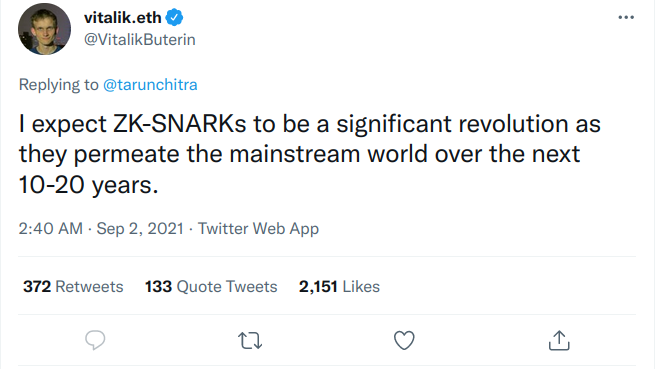
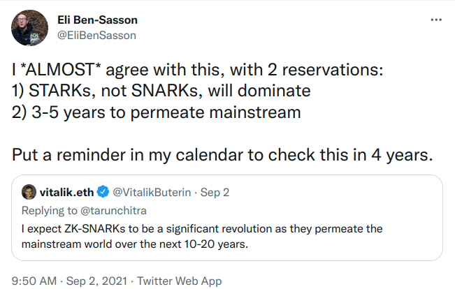

# STARK 算法解析, 第 0 部分: 导言

本教程共包含系列文章六篇，阐述了 STARK 证明系统的运行机制。 本教程面向拥有基础数学知识与编程知识的技术型读者。

* **第 0 部分：导言**
* [第 1 部分：STARK 总览](content/overview.md)
* [第 2 部分：有用的“工具”](content/basic-tools.md)
* [第 3 部分：FRI](content/fri.md)
* [第 4 部分：STARK Polynomial IOP](content/stark.md)
* [第 5 部分：A Rescue-Prime STARK](content/rescue-prime.md)
* [第 6 部分：加速整个流程](content/faster.md)

## 什么是 STARKs?

最近，密码学证明系统领域最令人兴奋的进展之一是 STARKs 的发展。它是在区块链行业蓬勃发展之后出现。整体上来看，证明系统似乎是为其量身定做的：区块链网络通常由相互不信任的各方组成，他们希望使用秘密信息进行交易，或根据状态演变规则更新集体状态。由于参与者是相互不信任的，因此他们需要验证其同伴提出的交易（或状态更新）的有效性的方法。
由于 zk-SNARKs 的以下特点，它们自然具备在这种环境中提供计算完整性保证的能力：

 - zk-SNARKs 一般是通用的，意味着它们能够证明任意计算的完整性；
 - zk-SNARKs 是非交互式的，这意味着整个完整性证明由单个消息组成；
 - zk-SNARKs 的验证是高效的，也就是说，与简单地重新运行计算相比，验证者的工作量会降低一个数量级（译者注：几个数量级也是有可能的）；
 - zk-SNARKs 是零知识的，这意味着它们不会泄露关于计算秘密输入的任何信息。

> "我期待 zk-SNARKs 在未来 10-20 年内渗透到主流世界，并引领一场重大的革命。" 
>
> 
————“V神” 2021.9.2

zk-SNARKs 已经存在了一段时间，但 STARK 证明系统是一个相对较新的东西。它的脱颖而出有几个原因：

 - 传统的 zk-SNARKs 依赖于尖端的密码学难题和假设，而 STARK 证明系统中唯一的密码学成分是一个抗碰撞的哈希函数。因此，在理想化的哈希函数模型[^1]下，该证明系统的抗量子安全性是可以被证明的。这与第一代 SNARKs 形成鲜明对比，后者使用双线性映射，且只在不可证伪的  (*unfalsifiable*）假设下具有可证明的安全性。
 - STARKs 的算术化是独立于密码学困难问题的，因此这个领域可以被专门选择来优化性能。因此，STARKs 使得真正的快速证明  (*prover*）成为可能。
 - 传统的 zk-SNARKs 依靠一个可信的设置仪式来产生公共参数。仪式结束后，使用的随机参数必须被安全地遗忘。仪式本身并非去信任的，因为如果参与者拒绝或忘记删除这种密码学上的“有害垃圾”，他们就会保留伪造证明的能力。相比之下，STARKs 没有可信的设置，因此没有密码学上的"有害垃圾“。

> "我基本同意，但在两点上持有保留意见:
>
> 1) 是 STARKs 将占主导地位，而不是 SNARKs
> 2) 3-5 年就会渗透到主流世界
>    在我的日历上写上提醒，以便4年后来检验这些话。“ 
>
>  
————Eli Ben-Sasson 2021.9.2

在本教程中，我将解释其中许多部分是如何一起工作的。这个文字解释由一个证明和验证基于 [Rescue-Prime](https://eprint.iacr.org/2020/1143.pdf) 哈希函数的简单计算的 Python 实现来支持。在阅读或学习了本教程之后，你应该能够为你选择的计算编写你自己的零知识 STARK 证明者和验证者。

## 为什么写作本文?

应该尽早指出，学习 STARKs 有多种来源。这里是一个不完整的列表。

 - 关于 [FRI](https://eccc.weizmann.ac.il/report/2017/134/revision/1/download/), [STARK](https://eprint.iacr.org/2018/046.pdf), [DEEP-FRI](https://eprint.iacr.org/2019/336.pdf) 的论文, 以及 [FRI 最新的可靠性分析](https://eccc.weizmann.ac.il/report/2020/083/)
 - Vitalik Buterin的多部分教程 （第 [I](https://vitalik.ca/general/2017/11/09/starks_part_1.html)/[II](https://vitalik.ca/general/2017/11/22/starks_part_2.html)/[3](https://vitalik.ca/general/2018/07/21/starks_part_3.html) 部分）
 - StarkWare 的一系列博文（第 [1](https://medium.com/starkware/stark-math-the-journey-begins-51bd2b063c71), [2](https://medium.com/starkware/arithmetization-i-15c046390862), [3](https://medium.com/starkware/arithmetization-ii-403c3b3f4355), [4](https://medium.com/starkware/low-degree-testing-f7614f5172db), [5](https://medium.com/starkware/a-framework-for-efficient-starks-19608ba06fbe) 部分）
 - StarkWare 的 [STARK @ Home](https://www.youtube.com/playlist?list=PLcIyXLwiPilUFGw7r2uyWerOkbx4GFMXq) 网络广播
 - StarkWare 的 [STARK 101](https://starkware.co/developers-community/stark101-onlinecourse/) 在线课程
 - StarkWare 的 [EthStark 文档](https://eprint.iacr.org/2021/582.pdf)
 - 一般来说，[StarkWare](https://starkware.co) 推出的任何东西

有了这么多学习资源，我为什么还要再写一个教程呢？

*已有的教程比较浅显。* 在从高层次上解释了这些技术是如何工作的方面，这些教程做得不错，并传达了一种直觉——为什么 STARKs 可以起作用。然而，它们没有描述一个完整的、可供部署的系统。例如，没有一个教程描述如何实现零知识，如何批处理各种低度证明，或如何确定由此产生的安全级别。EthSTARK 文档确实提供了一个完整的参考资料来回答这些问题中的大部分，但它是针对一个特定计算的，没有涵盖零知识，也没有给出一个易懂直观的解释。

*这些论文是难懂的。* 令人难过的是，科学出版业的激励机制被设定为：使科学论文对非专业读者来说难以阅读。因此，需要像本文这样的教程，以使这些论文能被更多的人理解。

*资料已经过时了。*各种教程中描述的许多技术后来都得到了改进。例如，EthSTARK 文档（上面引用的最新的文档）描述了一种* DEEP 插入技术*，以便将正确求值的要求降低到有界度的多项式。这些资料中没有提到这种技术，因为这些资料比该技术出现得更早。

*我更喜欢我自己的风格。* 我不同意很多符号和名称，我希望人们能使用正确的符号和名称。特别是，我喜欢把重点放在多项式上，作为证明系统的最基本对象。与此相反，所有其他资料都是以对里德-所罗门码字[^2]的操作来描述证明系统的机制。

*这个教程有助于我更好地理解 STARK。* 写这篇教程有助于我将自己的知识系统化，并找出其浅薄或完全缺乏的地方。

## 所需要的背景知识

本教程在需要的时候会温习一些背景知识。但建议所有读者还是了解和学习一下以下主题，因为如果不熟悉这些主题，这里的介绍可能会过于密集。

- 有限域及其扩展域
- 有限域上的多项式，包括单变量和多变量的多项式
- 快速傅里叶变换
- 哈希函数

## 系列向导

 - 第 1 部分：纵观 STARK  从高层次描绘了概念和工作流程 
 - 第 2 部分：有用的“工具”   介绍基本的数学和密码学工具，证明系统将由此建立
 - 第 3 部分：FRI  涵盖了低度测试，这是证明系统的密码学核心 
 - 第 4 部分：STARK Polynomial IOP（IOP, interactive oracle proof） 解释了从任意的计算性要求中生成抽象证明系统的信息理论 
 - 第 5 部分：A Rescue-Prime STARK  把这些工具放在一起，为一个简单的计算建立一个透明的零知识证明系统 
 - 第 6 部分：加速整个流程  引入算法和技术，使整个流程变得更快，有效地将 "S "(简洁性，succinct) 放入STARK   

## 致谢

作者希望感谢 Bobbin Threadbare、Thorkil Værge 和 Eli Ben-Sasson 的有用反馈和意见，以及 [Nervos](https://nervos.org) 基金会的资金支持。请给他发邮件： `alan@nervos.org` 或者在 twitter 或 Github上关注 `aszepieniec`。考虑捐赠 [btc](bitcoin:bc1qg32wme6sqltus5e9yzuq4y56xxc0rutly8ak7y), [ckb](nervos:ckb1qyq9s4rvld206a3rl6jmzxav4ffx58uj5prsv867ml) 或 [eth](ethereum:0x934B24cE32ceEDB38ce088Da1D9366Fa23F7B3f4)。

**0** - [1](overview.md) - [2](basic-tools.md) - [3](fri.md) - [4](stark.md) - [5](rescue-prime.md) - [6](faster.md)

[^1]: 在文献中，这种理想化被称为“量子随机预言机模型” 。
[^2]: 一个 Reed-Solomon 码字是一个低度多项式在给定点域上的求值结果组成的向量。当不同的码字的定义多项式不同但求值域相同时，它们属于同一编码。 