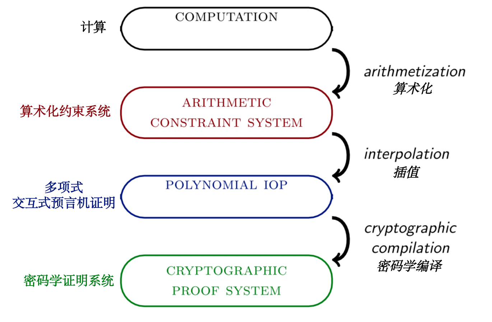

# 📃 STARK 算法解析（第 1 部分: STARK 总览）
STARKs 是一类交互式证明系统，但为了本教程的教学目的，最好将其视为 SNARKs 的一个特例，其中:
- 哈希函数是唯一的密码学成分；
- 算术化基于代数中间表达（AIR *- algebraic intermediate representation*），并将关于计算完整性的要求化简为关于某些多项式的低度（low-degree）的要求；
- 多项式的低度是通过使用 **FRI** 子协议来证明的，而 FRI 本身是通过默克尔树来实现的（作者注：FRI 被定义为可在任意位置进行查询的抽象预言机。因此，FRI 协议可以通过模拟使用密码学向量承诺方法的预言机而被编译成具体协议。Merkle 树提供了此功能，但并不是唯一能做到这一点的密码学原语。）；
- 零知识是可选项。

本教程的这一部分是解释 STARKs 的定义中的一些关键术语。

# 1. 交互式证明系统
在计算复杂性理论中，交互式证明系统是一个至少基于两方的协议，其中一方（即验证者）只有在某一数学声明为真时才会确信其正确性。在理论上，这个声明可以是任何可以用数学符号表达的东西，比如“贝赫和斯维纳通-戴尔猜想”、“P≠NP 问题” 或 "第十五个斐波那契数是 643617"。(在一个可靠的证明系统中，验证者会拒绝最后一个声明）

密码学证明系统将“交互式证明系统”的这一抽象概念转化为可以在现实世界中应用部署的具体对象。而在现实世界进行应用的限制也带来了一些相应的简化：

- 这个声明不是关于一个数学猜想，而是关于一个特定计算的完整性，比如 "电路 C 在输入 x 后得到输出 y"，或 "图灵机 M 在 T 步之后得到输出 y"。这种证明系统被称为建立了“计算完整性”。
- 该协议有两方，证明者和验证者。在不失一般性的情况下，验证者发给证明者的消息由纯粹的随机参数组成，在这种情况下（几乎总是这种情况），证明系统可以通过 Fiat-Shamir 变换转变为非交互式证明系统。非交互式证明系统只包括从证明者到验证者的单一信息。
- 与其说是实现了绝对安全，不如说验证者可以接受一个非零但小到可以忽略的“假阳性”或“假阴性”的可能。或者说，在证明者拥有有限计算能力的前提下，该证明系统可以提供真正的安全性。毕竟，所有真实计算机的计算能力都是有上限的。有时作者们会使用术语“论证系统”来区别于“证明系统”，后者提供了针对拥有无限计算能力的证明者的安全性；使用“论证”指代由非交互性变换产生的“对话脚本“。
- 为什么验证者不能简单地重新运行计算完整性声明所包含的计算呢？这是因为证明者拥有验证者无法获得的资源。
  - 当受限制的资源是时间时，验证者的运行速度应该比程序的简单重新执行快一个数量级。实现这一特性的证明系统被称为简洁的 *(succinct)* 或具有简洁的验证过程。
  - 简明验证过程需要简短的证明，但一些证明系统，如 Bulletproofs 或 Aurora，具有紧凑简洁 *(compact)* 的证明，但验证者的验证过程仍十分缓慢。
  - 当验证者不能接触到证明者使用的秘密信息，而证明系统又能保护这一秘密的隐私性时，证明系统就满足了零知识性。验证者可以确信一个计算声明的真实性，同时不知道关于该计算的某些或全部的输入信息。
- 特别是在零知识证明系统的背景下，计算的完整性要求可能需要一个微小的修正。在某些情况下，仅仅证明一个声明的正确性是不够的，证明者还必须另加证明：他知道额外的秘密输入，而且还可以直接输出秘密而不仅仅是产生证明（作者注：正式来说，“知识” 的定义如下：必须存在一种“提取器”算法，该算法具有对“可能是恶意的证明者”的预言访问权，假装是匹配的验证者（能读取来自证明者的消息并通过相同的接口发送自己的消息），有能力通过“倒带”的方式，将“可能是恶意的证明者”倒退到任何较早的时间点，整个过程以多项式时间运行，并输出证据 witness。STARKs 已被证明满足这一特性，见 EthSTARK 文档的第 5 节）。能实现这种具有知识健全性概念的证明系统被称为知识证明（或知识论证）。

SNARK 是一个简洁的非交互式知识论证 *（Succinct Non-interactive ARgument of Knowledge）*。创造了 SNARK 这个术语的[论文](https://eprint.iacr.org/2011/443.pdf)用简洁 *(succinct)* 来表示具有高效验证者的证明系统。然而，近年来，这个术语的含义已经被淡化，现在这个术语包括任何证明是紧凑 *(compact)* 的系统。本教程内容皆基于原始论文定义。

# 2. STARK 总览
STARK 是“可扩展透明知识论证”*（Scalable Transparent ARgument of Knowledge）* 的缩写。可扩展*（Scalable）* 指的是两件同时发生的事情:
1. 证明者的运行时间最多只能与计算的规模成拟线性关系，这与 SNARKs 不同。在 SNARKs 中，证明者被允许拥有一个高到令人望而却步的时间复杂性 
2. 验证时间与计算的规模成多项式对数关系。
 
透明（Transparent）是指所有验证者的信息只是公开采样的随机值。特别是，不需要可信的设置仪式来实例化证明系统，因此不存在密码学上的"有毒废物"。这个缩写的含义表明，非交互式 STARKs 是 SNARKs 的一个子类，事实上也是如此，但是这个术语一般用来指可扩展的透明 SNARKs 的具体构造。

用编译流水线的方法可以最直观的展示STARK的主要特性。根据细化程度的不同，我们可以选择将这个过程细分为更多或更少的步骤。在这里，为了介绍 STARKs，编译流程被分为四个阶段和三次转换。在本教程的后续部分，会有一个更精细的编译流程和图表。

# 3. 计算过程
整个流程的输入是一个*计算过程*，你可以把它看成是一个程序、一个输入和一个输出。这三者都是以机器友好的格式提供的，比如一个字节的列表。一般来说，程序由指令组成，这些指令决定机器如何操作其资源。如果一个机器的某种正确的指令集可以模拟任何图灵机，那么可以说这个机器的架构是图灵完备的。

在本教程中，程序被硬编码到机器架构中。因此，允许用于计算的空间是相当有限的。尽管如此，输入和输出仍然是可变的。

一个计算所需要的资源可能是时间、内存、随机性、秘密信息、并行性。我们的目标是将计算过程转化为另一种形式，使得即使是资源受限的验证者也能够轻松验证其完整性。除上述计算资源之外，还有更多类型的资源可供研究探讨，比如纠缠的量子比特、非确定性、或者计算一个给定的黑盒函数的预言机，但由此产生的问题通常是计算复杂性理论的主题，而不是密码学实践应该探讨的话题。

# 4.  算术化和算术化约束系统阶段
流程中的第一个转换被称为*算术化* *（arithmetization）*。在这个过程中，用比特流表示的基本的逻辑和算术运算序列被转化为有限域元素的运算操作序列，从而使两者代表相同的计算过程。计算输出是一个算术化约束系统，本质上是一串方程，所有方程的系数和变量的取值都来自有限域。当且仅当算数化约束系统有一个令人满意的解决方案（有正确解）时，计算才是完整的——也就是说，存在对变量的单一赋值使得所有方程都成立。

STARK 证明系统对计算的算术化过程如下。在任一时间点上，计算的状态都包含在一个元组中（一个元组包含 $$\mathsf{w}$$ 个寄存器），这些寄存器从有限域 $$\mathbb{F}$$ 中取值。机器内定义了一个状态转换函数 $$f : \mathbb{F}^\mathsf{w} \rightarrow \mathbb{F}^\mathsf{w}$$ ，每个周期都会更新寄存器状态。*代数执行轨迹（AET）*是按时间顺序排列的所有状态元组的列表。

算术化约束系统在代数执行轨迹上至少定义了两类约束：
- 边界约束：在计算阶段的开始或结束时，一个指定的寄存器有一个给定的值。
- 状态转移约束：任何两个连续的状态元组都是按照状态转移函数转变的。
总的来说，这些约束被称为*代数中间表示法（AIR）* 。高级 STARK 可以定义更多的约束类型，以处理内存或一个周期内寄存器的一致性问题。

# 5. 插值和多项式 IOPs 阶段
通常意义上的插值意味着找到一个通过一组数据点的多项式。在 STARK 编译流程的背景下，插值意味着找到一个通过多项式表示的算术化约束系统。由此产生的对象不是一个算术化约束系统，而是一个抽象的协议，称为多项式交互式预言机证明*（IOP）*。

常规证明系统中的证明者向验证者发送消息。但是当验证者被禁止阅读这些信息时，会发生什么？具体来说，如果来自证明者的信息被预言机所取代，那么该协议就是一个交互式预言机证明（IOP）。交互式预言机可以被看作是一个抽象的黑盒子，通过它，验证者可以在他选择的点上进行查询。当预言机对应于低度的多项式时，它就是一个多项式 IOP。显而易见的是，诚实的证明者拥有一个所有方程都成立的多项式约束系统，而不诚实、作弊的证明者虽然拥有的一个多项式约束系统，但是其中至少有一个方程是错误的。当两个多项式相等时，它们在任何地方都是相等的，特别是在验证者任意选择的随机点上。但是当两个多项式不相等时，它们几乎在任何地方都不相等（译者注：两个度相同且为$$d$$的不同多项式最多只有$$d$$个交点，那么只要选点范围足够大，它们两就几乎在任何地方都不相等），当验证者在随机点上进行检验时，这种不相等就会大概率地暴露出来。

STARK 证明系统插值了代数执行轨迹——也就是说，它找到 $$\mathsf{w}$$ 个多项式 $$t_i(X)$$，使 $$t_i(X)$$ 在域 $$D$$ 上的值等于代数执行轨迹第 $$i$$ 个寄存器的代数执行轨迹。这些多项式被作为预言机发送给验证者。此时，利用 AIR 约束进行多项式操作：将轨迹多项式转变为商式（只有当轨迹多项式满足 AIR 约束且为低度多项式时，商式才同样也是一个低度多项式），验证者模拟这些操作，可以得出这样新的多项式，其低度证明了约束系统的可满足性（存在正确解），从而证明了计算的完整性。换句话说，插值步骤将算术化约束系统的可满足性转变为对某些多项式低度的要求。

# 6. 用 FRI 进行密码学编译阶段
在现实世界中，多项式预言机并不存在。想要使用多项式 IOP 作为中间阶段的协议，设计者必须找到一种方法来“承诺”*（commit）*一个多项式，然后在验证者选择的一个点上“打开”*（open）*该多项式（指计算 Merkle 树中一个指定叶子的认证路径，即向验证者展示此点之前“承诺”的值）。FRI 是 STARK 证明的一个关键组成部分，它实现了上述任务，它通过使用 Reed-Solomon 编码的 Merkle 树来证明多项式的度的有界性。
Reed-Solomon 编码与多项式 $$f(X)$$ 相关（其中 $$f(X) \in \mathbb{F}[X]$$ ），是在一个给定域 $$D$$ 上的取值列表（其中 $$D \subset \mathbb{F}$$）。在一般的情况下，域 $$D$$ 中的元素个数大于多项式允许的最大度数。这些值可以被放入 Merkle 树中，在此场景中，Merkle 树的树根可以看作是对此多项式的一个“承诺”。快速里德-所罗门码接近交互预言机证明（FRI，The Fast Reed-Solomon IOP of Proximity）是一个协议，在该协议中，证明者发送一个 Merkle 根的序列，每个 Merkle 根对应于一个编码（编码的长度在每次迭代后减半）。验证者检查连续几次迭代的 Merkle 树（具体而言：要求证明者提供指定的叶子和它们的认证路径），以测试一个简单的线性关系。对于诚实的证明者，提交的多项式的度数每经过一轮就会减半一次，因此远远小于码字的长度。然而，对于恶意证明者来说，这个度数只比码字的长度小 1。在最后一步，证明者发送一个不简单的码字，对应一个常数多项式。

有一个小问题是上述描述中没有涉及的：验证者如何在一个不属于该域的点$$z$$上查询“承诺”多项式 $$f(X)$$ 的值呢？原则上，有一个显而易见的解决方案：验证者将 $$z$$ 发送给证明者，而证明者则通过发送 $$y=f(z)$$ 来回应。多项式 $$f(X) - y$$ 在 $$X=z$$ 处等于零，所以多项式 $$f(X) - y$$ 一定能被 $$X-z$$ 整除。因此，验证者和证明者都可以获得一个新的低度多项式：$$\frac{f(X) - y}{X-z}$$。 如果证明者在 $$f(z)=y$$ 上说谎（即 $$f(z) \neq y$$ ） ，那么他就没有能力证明 $$\frac{f(X) - y}{X-z}$$ 的低阶性。所以他的欺诈行为将在 FRI 协议的过程中被揭露。事实上，这正是边界约束（boundary constraints）实施的机制；一个略微复杂但类似的结构可于状态转移约束（transition constraints ）。新的多项式是除掉（约掉）已知因子的结果，所以它们将被称为商式，表示为 $$q_i(X)$$。

可见，经过上述流程，多项式 IOP 已经被编译成一个交互式具体证明系统。原则上，该协议可以被执行使用。然而，再做一步密码学编译是值得的：用伪随机（同时也是确定的）代替验证者的随机选择。这正是 Fiat-Shamir 变换，经过变换得到是被称为 STARK 的非交互式证明。

上述描述忽略了许多细节问题。本教程的剩余部分将用更具体、可感的术语来解释，并将在图中加入更细节的内容和步骤。

[0](index.md) - **1** - [2](basic-tools.md) - [3](fri.md) - [4](stark.md) - [5](rescue-prime.md) - [6](faster.md)