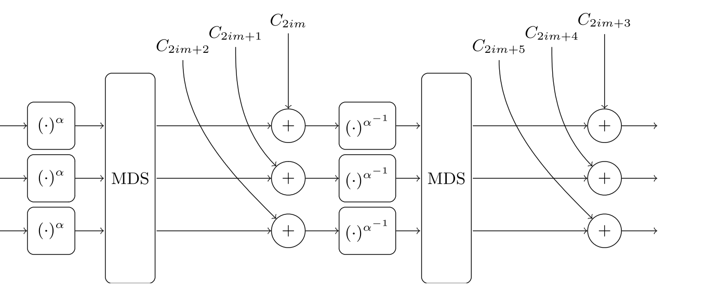
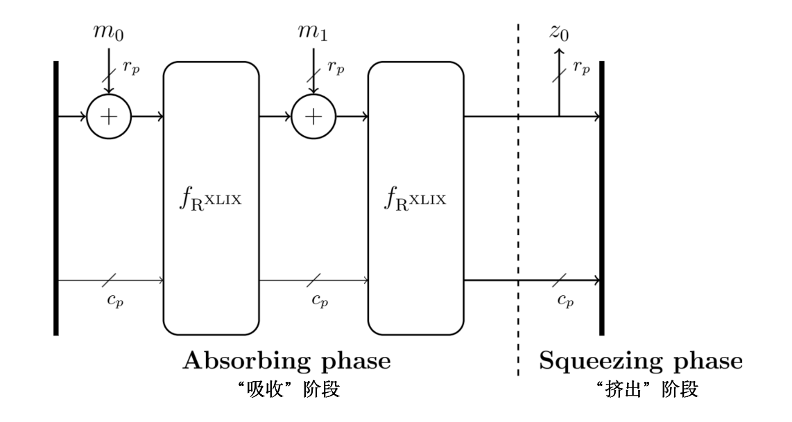

# 📃 STARK 算法解析（第 5 部分: A Rescue-Prime STARK）

本教程的这一部分把前面几部分的“几个工具”整合在一起，构建一个具体、有用的 STARK 证明系统。此系统用于产生一个 STARK 证明，证明 Rescue-Prime 哈希函数在一个已知输出的秘密输入上的正确求值。该证明具体来说也是有用的，因为产生的非交互式证明同时可以作为一个后量子签名方案。

# 1. Rescue-Prime
[Rescue-Prime](https://eprint.iacr.org/2020/1143.pdf) 是一个面向算术化的哈希函数，意味着它使用 AIR 会有一个紧致的描述。它是一个由 Rescue-XLIX 置换：$$f_{\mathrm{R}^{\mathrm{XLIX}}} : \mathbb{F}^m \rightarrow \mathbb{F}^m$$ 构建的海绵函数，包括若干个“几乎相同”的轮。每一轮由六个步骤组成：
1. 前向-S盒<font color="708090">（Forward S-box）</font>。对状态中的每个元素进行 $$\alpha$$ 次幂运算，其中 $$\alpha$$ 是最小的可逆次幂。
2. MDS。状态元素的向量乘以一个具有特殊属性的矩阵。
3. 轮常数<font color="708090">（Round constants）</font>。预先定义的常数被加到状态的每个元素中。
4. 后向-S盒<font color="708090">（Backward S-box）</font>。对状态的每个元素进行 $$\alpha^{-1}$$ 次幂运算，得到其幂函数是 $$x \mapsto x^\alpha$$ 的逆运算的整数。
5. MDS。状态元素的向量乘以一个具有特殊属性的矩阵。
6. 轮常数。预先定义的常数被加到状态的每个元素中。

<center></center>


每一轮*几乎*都是相同的，但不完全是，因为每一轮的轮常数都不同。虽然“后向-S盒”步骤似乎是一个高阶的操作，但正如我们将看到的，Rescue-XLIX 轮函数的所有六个步骤都可以由阶为 $$\alpha$$ 的非决定性状态转移约束来记录。

一旦定义了 Rescue-XLIX 置换，就可以用它实例化一个海绵函数来获得 Rescue-Prime。在这个构造中，输入的域元素在置换之间被吸收到状态的顶部 $$r$$ 个元素中。在最后一次置换后，顶部的 $$r$$ 个元素被读出。Rescue-Prime 的哈希摘要包括了这 $$r$$ 个元素。

<center></center>


此处展示的 STARK 证明，使用了以下参数：
- 含有 $$p = 407 \cdot 2^{119} + 1$$ 个元素的素域
- $$\alpha = 3$$ 且 $$\alpha^{-1} = 180331931428153586757283157844700080811$$
- $$m = 2$$
- $$r = 1$$

此外，哈希计算的输入将是一个单一的域元素。所以特别地，将会只有一轮吸收和一次置换的应用。

# 2. 代码实现
[Rescue-Prime 论文](https://eprint.iacr.org/2020/1143.pdf)提供了几乎完整的参考实现。然而，这里的代码是针对这一个应用量身定做的。

```python
class RescuePrime:
    def __init__( self ):
        self.p = 407 * (1 << 119) + 1
        self.field = Field(self.p)
        self.m = 2
        self.rate = 1
        self.capacity = 1
        self.N = 27
        self.alpha = 3
        self.alphainv = 180331931428153586757283157844700080811
        self.MDS = [[FieldElement(v, self.field) for v in [270497897142230380135924736767050121214, 4]],
                    [FieldElement(v, self.field) for v in [270497897142230380135924736767050121205, 13]]]
        self.MDSinv = [[FieldElement(v, self.field) for v in [210387253332845851216830350818816760948, 60110643809384528919094385948233360270]],
                       [FieldElement(v, self.field) for v in [90165965714076793378641578922350040407, 180331931428153586757283157844700080811]]]
        self.round_constants = [FieldElement(v, self.field) for v in [174420698556543096520990950387834928928,109797589356993153279775383318666383471,228209559001143551442223248324541026000,268065703411175077628483247596226793933,250145786294793103303712876509736552288,154077925986488943960463842753819802236,204351119916823989032262966063401835731,57645879694647124999765652767459586992,102595110702094480597072290517349480965,8547439040206095323896524760274454544,50572190394727023982626065566525285390,87212354645973284136664042673979287772,64194686442324278631544434661927384193,23568247650578792137833165499572533289,264007385962234849237916966106429729444,227358300354534643391164539784212796168,179708233992972292788270914486717436725,102544935062767739638603684272741145148,65916940568893052493361867756647855734,144640159807528060664543800548526463356,58854991566939066418297427463486407598,144030533171309201969715569323510469388,264508722432906572066373216583268225708,22822825100935314666408731317941213728,33847779135505989201180138242500409760,146019284593100673590036640208621384175,51518045467620803302456472369449375741,73980612169525564135758195254813968438,31385101081646507577789564023348734881,270440021758749482599657914695597186347,185230877992845332344172234234093900282,210581925261995303483700331833844461519,233206235520000865382510460029939548462,178264060478215643105832556466392228683,69838834175855952450551936238929375468,75130152423898813192534713014890860884,59548275327570508231574439445023390415,43940979610564284967906719248029560342,95698099945510403318638730212513975543,77477281413246683919638580088082585351,206782304337497407273753387483545866988,141354674678885463410629926929791411677,19199940390616847185791261689448703536,177613618019817222931832611307175416361,267907751104005095811361156810067173120,33296937002574626161968730356414562829,63869971087730263431297345514089710163,200481282361858638356211874793723910968,69328322389827264175963301685224506573,239701591437699235962505536113880102063,17960711445525398132996203513667829940,219475635972825920849300179026969104558,230038611061931950901316413728344422823,149446814906994196814403811767389273580,25535582028106779796087284957910475912,93289417880348777872263904150910422367,4779480286211196984451238384230810357,208762241641328369347598009494500117007,34228805619823025763071411313049761059,158261639460060679368122984607245246072,65048656051037025727800046057154042857,134082885477766198947293095565706395050,23967684755547703714152865513907888630,8509910504689758897218307536423349149,232305018091414643115319608123377855094,170072389454430682177687789261779760420,62135161769871915508973643543011377095,15206455074148527786017895403501783555,201789266626211748844060539344508876901,179184798347291033565902633932801007181,9615415305648972863990712807943643216,95833504353120759807903032286346974132,181975981662825791627439958531194157276,267590267548392311337348990085222348350,49899900194200760923895805362651210299,89154519171560176870922732825690870368,265649728290587561988835145059696796797,140583850659111280842212115981043548773,266613908274746297875734026718148328473,236645120614796645424209995934912005038,265994065390091692951198742962775551587,59082836245981276360468435361137847418,26520064393601763202002257967586372271,108781692876845940775123575518154991932,138658034947980464912436420092172339656,45127926643030464660360100330441456786,210648707238405606524318597107528368459,42375307814689058540930810881506327698,237653383836912953043082350232373669114,236638771475482562810484106048928039069,168366677297979943348866069441526047857,195301262267610361172900534545341678525,2123819604855435621395010720102555908,96986567016099155020743003059932893278,248057324456138589201107100302767574618,198550227406618432920989444844179399959,177812676254201468976352471992022853250,211374136170376198628213577084029234846,105785712445518775732830634260671010540,122179368175793934687780753063673096166,126848216361173160497844444214866193172,22264167580742653700039698161547403113,234275908658634858929918842923795514466,189409811294589697028796856023159619258,75017033107075630953974011872571911999,144945344860351075586575129489570116296,261991152616933455169437121254310265934,18450316039330448878816627264054416127]]

    def hash( self, input_element ):
        # absorb
        state = [input_element] + [self.field.zero()] * (self.m - 1)

        # permutation
        for r in range(self.N):
            
            # forward half-round
            # S-box
            for i in range(self.m):
                state[i] = state[i]^self.alpha
            # matrix
            temp = [self.field.zero() for i in range(self.m)]
            for i in range(self.m):
                for j in range(self.m):
                    temp[i] = temp[i] + self.MDS[i][j] * state[j]
            # constants
            state = [temp[i] + self.round_constants[2*r*self.m+i] for i in range(self.m)]

            # backward half-round
            # S-box
            for i in range(self.m):
                state[i] = state[i]^self.alphainv
            # matrix
            temp = [self.field.zero() for i in range(self.m)]
            for i in range(self.m):
                for j in range(self.m):
                    temp[i] = temp[i] + self.MDS[i][j] * state[j]
            # constants
            state = [temp[i] + self.round_constants[2*r*self.m+self.m+i] for i in range(self.m)]

        # squeeze
        return state[0]
```

## 2.1 Rescue-Prime AIR
单轮 Rescue-XLIX 置换 的状态转移约束条件是用开始时的状态值来表达该轮中间的状态值，并再次用结束时的状态值来表达，然后将这两个表达式等同起来。具体来说，用 $${s}_ {i}$$ 表示第 $$i$$ 回合开始时的状态值，定义 $${c}_ {2i}$$ 和 $${c}_ {2i+1}$$ 为轮常数，定义 $$M$$ 为 MDS 矩阵，用上标表示元素的幂。那么，单轮的转换由以下方程描述：

<center>$$M ({s}_i^\alpha) + {c}_{2i} = \left(M^{-1} ({s}_{i+1} - {c}_{2i+1})\right)^\alpha$$</center>

为了在 STARK 中使用，状态转移约束不能依赖于单一回合。换句话说，我们需要的是一个描述所有回合的单一方程，而不仅仅是第 $$i$$ 轮。定义 $$X$$ 为表示当前状态（本轮开始时）的变量向量，定义 $$Y$$ 为表示下一个状态（本轮结束时）的变量向量。此外，定义 $$f_{c_{2i}}(W)$$ 为表示在 $$\omicron^i$$ 上取值为 $${c}_ {2i}$$ 的 $$m$$ 个多项式的向量，类似地，定义 $$f_ {c_{2i+1}}(W)$$。

假设在不失一般性的情况下，执行轨迹将在定义域 $$\lbrace \omicron^i \vert 0 \leq i \leq T\rbrace$$ 上（对于某些 $$T$$）被插值。那么上述算术化状态转移约束就会产生以下描述相同状态转移条件的等式：

<center>$$M({X}^\alpha) + f_ {c_ {2i}}(W) = \left(M^{-1}({Y} - f_ {c_{2i+1}}(W))\right)^\alpha$$ </center>

状态转移约束多项式是通过将所有项移到左手边，使得等式右边零得到的。请注意，有 $$2m+1$$ 个变量，对应于 $$m=w$$ 个寄存器。


```python
def round_constants_polynomials( self, omicron ):
        first_step_constants = []
        for i in range(self.m):
            domain = [omicron^r for r in range(0, self.N)]
            values = [self.round_constants[2*r*self.m+i] for r in range(0, self.N)]
            univariate = Polynomial.interpolate_domain(domain, values)
            multivariate = MPolynomial.lift(univariate, 0)
            first_step_constants += [multivariate]
        second_step_constants = []
        for i in range(self.m):
            domain = [omicron^r for r in range(0, self.N)]
            values = [self.field.zero()] * self.N
            #for r in range(self.N):
            #    print("len(round_constants):", len(self.round_constants), " but grabbing index:", 2*r*self.m+self.m+i, "for r=", r, "for m=", self.m, "for i=", i)
            #    values[r] = self.round_constants[2*r*self.m + self.m + i]
            values = [self.round_constants[2*r*self.m+self.m+i] for r in range(self.N)]
            univariate = Polynomial.interpolate_domain(domain, values)
            multivariate = MPolynomial.lift(univariate, 0)
            second_step_constants += [multivariate]

        return first_step_constants, second_step_constants

    def transition_constraints( self, omicron ):
        # get polynomials that interpolate through the round constants
        first_step_constants, second_step_constants = self.round_constants_polynomials(omicron)

        # arithmetize one round of Rescue-Prime
        variables = MPolynomial.variables(1 + 2*self.m, self.field)
        cycle_index = variables[0]
        previous_state = variables[1:(1+self.m)]
        next_state = variables[(1+self.m):(1+2*self.m)]
        air = []
        for i in range(self.m):
            # compute left hand side symbolically
            # lhs = sum(MPolynomial.constant(self.MDS[i][k]) * (previous_state[k]^self.alpha) for k in range(self.m)) + first_step_constants[i]
            lhs = MPolynomial.constant(self.field.zero())
            for k in range(self.m):
                lhs = lhs + MPolynomial.constant(self.MDS[i][k]) * (previous_state[k]^self.alpha)
            lhs = lhs + first_step_constants[i]

            # compute right hand side symbolically
            # rhs = sum(MPolynomial.constant(self.MDSinv[i][k]) * (next_state[k] - second_step_constants[k]) for k in range(self.m))^self.alpha
            rhs = MPolynomial.constant(self.field.zero())
            for k in range(self.m):
                rhs = rhs + MPolynomial.constant(self.MDSinv[i][k]) * (next_state[k] - second_step_constants[k])
            rhs = rhs^self.alpha

            # equate left and right hand sides
            air += [lhs-rhs]

        return air
```

边界约束就简单多了。在开始时，第一个状态元素是未知的秘密，第二个状态元素是零，因为海绵结构就是这样定义的。在结束时（在所有 $$N$$ 轮或 $$T$$ 循环后），第一个状态元素是已知哈希摘要 $$[h]$$ 的一个元素，而第二个状态元素是不受限制的。请注意，这第二个状态元素必须保持秘密才是安全的——否则攻击者就会反转置换。这种描述产生了以下的三元组集合 $$\mathcal{B}$$：

<center>$$(c, r, e) \in \lbrace 0, \ldots, T \rbrace \times \lbrace 0, \ldots, \mathsf{w}-1 \rbrace \times \mathbb{F}$$</center>

- $$(0, 1, 0)$$
- $$(T, 0, h)$$

```python
def boundary_constraints( self, output_element ):
        constraints = []

        # at start, capacity is zero
        constraints += [(0, 1, self.field.zero())]

        # at end, rate part is the given output element
        constraints += [(self.N, 0, output_element)]

        return constraints
```

算术化的部分是证据，对于 STARKs 来说，它是执行轨迹。在这个特定的计算中，除了最开始的状态外，执行轨迹还是每一轮之后的状态集合。

```python
 def trace( self, input_element ):
        trace = []

        # absorb
        state = [input_element] + [self.field.zero()] * (self.m - 1)

        # explicit copy to record state into trace
        trace += [[s for s in state]]

        # permutation
        for r in range(self.N):
            
            # forward half-round
            # S-box
            for i in range(self.m):
                state[i] = state[i]^self.alpha
            # matrix
            temp = [self.field.zero() for i in range(self.m)]
            for i in range(self.m):
                for j in range(self.m):
                    temp[i] = temp[i] + self.MDS[i][j] * state[j]
            # constants
            state = [temp[i] + self.round_constants[2*r*self.m+i] for i in range(self.m)]

            # backward half-round
            # S-box
            for i in range(self.m):
                state[i] = state[i]^self.alphainv
            # matrix
            temp = [self.field.zero() for i in range(self.m)]
            for i in range(self.m):
                for j in range(self.m):
                    temp[i] = temp[i] + self.MDS[i][j] * state[j]
            # constants
            state = [temp[i] + self.round_constants[2*r*self.m+self.m+i] for i in range(self.m)]
            
            # record state at this point, with explicit copy
            trace += [[s for s in state]]

        return trace
```

# 3. 基于 STARK 的签名
一个非交互式的零知识证明系统可以被转化为一个签名方案。问题是，它必须能够证明拥有“一个密码学困难问题的解”的知识。STARKs 可以被用来证明任意复杂的计算声明。然而，Rescue-Prime 的全部意义在于，它以“对 STARK 友好”的方式生成密码学困难问题的实例——具体来说，就是一个紧致的 AIR。因此，让我们把一个对 Rescue-Prime 的 STARK 转换成一个签名方案。

## 3.1 Rescue-Prime STARK
为 STARK 定义一个用于 Rescue-Prime 的证明者和验证者，只需要将现有的代码片段连接起来即可。

```python
class RPSSS:
    def __init__( self ):
        self.field = Field.main()
        expansion_factor = 4
        num_colinearity_checks = 64
        security_level = 2 * num_colinearity_checks

        self.rp = RescuePrime()
        num_cycles = self.rp.N+1
        state_width = self.rp.m

        self.stark = Stark(self.field, expansion_factor, num_colinearity_checks, security_level, state_width, num_cycles, transition_constraints_degree=3)

    def stark_prove( self, input_element, proof_stream ):
        output_element = self.rp.hash(input_element)

        trace = self.rp.trace(input_element)
        transition_constraints = self.rp.transition_constraints(self.stark.omicron)
        boundary_constraints = self.rp.boundary_constraints(output_element)
        proof = self.stark.prove(trace, transition_constraints, boundary_constraints, proof_stream)
 
        return proof

    def stark_verify( self, output_element, stark_proof, proof_stream ):
        boundary_constraints = self.rp.boundary_constraints(output_element)
        transition_constraints = self.rp.transition_constraints(self.stark.omicron)
        return self.stark.verify(stark_proof, transition_constraints, boundary_constraints, proof_stream)
```

注意关于证明流的显式论证。它必须是一个特殊的对象，它可以模拟*依赖*于消息的 Fiat-Shamir 转换，而不是常规的转换。

## 3.2 依赖于消息的 Fiat-Shamir 变换

为了将零知识证明系统转换为签名方案，必须将非交式证明与被签名的文档绑定。传统上，通过 Fiat-Shamir 变换实现这一点的方法是将验证者的伪随机响应定义为“文档和整个协议的对话脚本”拼接起来的哈希摘要，拼接过程直到需要输出为止。

就代码实现而言，这需要一个新的证明流对象——一个知道这个需要被生成签名和验证的文档的对象。下一个类用于实现这个对象。

```python
class SignatureProofStream(ProofStream):
    def __init__( self, document ):
        ProofStream.__init__(self)
        self.document = document
        self.prefix = blake2s(bytes(document)).digest()

    def prover_fiat_shamir( self, num_bytes=32 ):
        return shake_256(self.prefix + self.serialize()).digest(num_bytes)

    def verifier_fiat_shamir( self, num_bytes=32 ):
        return shake_256(self.prefix + pickle.dumps(self.objects[:self.read_index])).digest(num_bytes)

    def deserialize( self, bb ):
        sps = SignatureProofStream(self.document)
        sps.objects = pickle.loads(bb)
        return sps
```

## 3.3 签名方案
此时，可以定义组成签名方案的密钥生成、签名生成和签名验证功能。注意，这些函数是 Rescue-Prime STARK Signature Scheme （RPSSS）类的成员，其定义在上文已涉及。

```python
# class RPSSS:
    def keygen( self ):
        sk = self.field.sample(os.urandom(17))
        pk = self.rp.hash(sk)
        return sk, pk

    def sign( self, sk, document ):
        sps = SignatureProofStream(document)
        signature = self.stark_prove(sk, sps)
        return signature

    def verify( self, pk, document, signature ):
        sps = SignatureProofStream(document)
        return self.stark_verify(pk, signature, sps)
```

这段代码定义了一个*可证明安全的*<font color="708090">（笔者注：更具体地说，在随机预言机模型中，一个成功的签名伪造者会产生一个敌手，它以多项式相关的运行时间和成功概率打破 Rescue-Prime 的单向性。）</font>，（几乎）达到 128 位安全级别的*后量子*签名方案。虽然这种描述听起来很讨人喜欢，但该方案的性能指标却远没有这么讨人喜欢：
- 密钥大小：16 字节（耶！）
- 公钥大小：16 字节（耶！）
- 签名大小：～ 133 kb
- 密钥生成时间：0.01 秒（可接受）
- 签名时间：250 秒
- 验证时间：444 秒

可能存在一些优化方法可以缩减证明的大小，比如在打开一批 Merkle 叶子节点时合并共同路径。然而，这些优化方法超出了本教程的教学目的，本教程旨在强调和解释所涉及的数学知识。

在速度方面，很多地方性能不佳的原因是使用了 Python，而不是使用更贴近硬件的语言，比如 C 或 rust。选择 Python 也是出于同样的原因——突出和解释数学知识。但是就速度而言，最大的性能提升将来自于关键操作算法的优化。这将是本教程的下一部分也是最后一部分的主题。


[0](index.md) - [1](overview.md) - [2](basic-tools.md) - [3](fri.md) - [4](stark.md) - **5** - [6](faster.md)