# 📃 STARK 算法解析（第 4 部分: STARK Polynomial IOP）

本教程的这一部分涉及 STARK 证明系统信息论骨干，你可以称之为 STARK 多项式 IOP。回顾一下 SNARKs 的编译流程涉及到的中间阶段，其中前两个阶段是*算术约束系统*和*多项式 IOP*。本教程也会描述算术约束系统的一些特性。然而，“将原始计算过程转化为算术约束系统”的*算术化步骤*超出了本文的讨论范围。我们将详细讨论插值步骤，插值步骤将这个算术约束系统转换成多项式 IOP。最终的多项式 IOP 可以使用第 3 部分中描述的“基于 FRI 的编译器”编译成一个具体实用的证明系统。

# 1. 算术中间表示 (AIR)
算术中间表示*（AIR，或称算术内部表示）*是一种用执行轨迹来描述计算过程的方式，该执行轨迹满足由状态的正确演变所引起的一些约束。术语*“算术”*是指这一执行轨迹由有限域元素的列表（如果涉及一个以上的寄存器，则是一个数组）组成，并且约束条件可以用低阶多项式来表达。

下面叙述得更加具体一些。令 $$\mathbb{F}_p$$ 为定义域。在不失一般性的情况下，计算过程描述了 $$\mathsf{w}$$ 个寄存器在 $$T$$ 个系统周期中的状态演变。*代数执行轨迹（AET）*是一个由 $$T \times \mathsf{w}$$ 个域元素组成的表，其中每一行都描述了系统在给定时间点上的状态，每一列追踪了对应寄存器的值。

*状态转移函数：*

<center>$$f : \mathbb{F}_p^\mathsf{w} \rightarrow \mathbb{F}_p^\mathsf{w}$$</center>

是基于上一个系统周期寄存器状态的函数，它决定了下一个系统周期的寄存器状态。此外，边界条件列表：

<center>$$\mathcal{B} : [\mathbb{Z}_T \times \mathbb{Z}_\mathsf{w} \times \mathbb{F}]$$</center>

在第一个系统周期、最后一个系统周期，甚至在任意的系统周期，规定一些或所有寄存器的正确值。

*计算完整性断言*由状态转移函数和边界约束条件组成。这一断言的*证据*<font color="708090">*（witness）*</font>是代数执行轨迹。当且仅当存在一个证据 $$W \in \mathbb{G}^{T \times \mathsf{w}}$$ 满足以下条件时，我们才说这个计算完整性断言是正确的：

- 对于每个系统周期，状态转移都是正确的：$$\forall i \in \lbrace 0, \ldots, T-1 \rbrace \, . \, f(W_{[i,:]}) = W_{[i+1,:]}$$；
- 所有边界约束条件都满足：$$\forall (i, w, e) \in \mathcal{B} \, . \, W_{[i,w]} = e$$。

状态转移函数暗藏了很多复杂的内容。为了实现 STARKs ，它需要被描述为*独立于系统周期*的低阶多项式。然而，这个多项式列表并不需要从当前状态计算出下一个状态；它只需要区分正确的状态转移和不正确的状态转移即可。具体来说，函数

<center>$$f : \mathbb{F}_p^\mathsf{w} \rightarrow \mathbb{F}_p^\mathsf{w}$$</center>

由一个多项式列表表示：$$\mathbf{p}(X_0, \ldots, X_{\mathsf{w}-1}, Y_{0}, \ldots, Y_{ \mathsf{w}-1})$$，当且仅当 $$\mathbf{p}(\mathbf{x}, \mathbf{y}) = \mathbf{0}$$ 时，$$f(\mathbf{x}) = \mathbf{y}$$ 才成立。 假设有 $$r$$ 个这样的状态转移验证多项式。那么状态转移约束就变成为：

<center>$$\forall i \in \lbrace 0, \ldots, T - 1 \rbrace \, . \, \forall j \in \lbrace 0, \ldots, r-1\rbrace \, . \, p_j(W_{[i,0]}, \ldots, W_{[i, \mathsf{w}-1]}, W_{[i+1,0]}, \ldots, W_{[i+1, \mathsf{w}-1]}) = 0$$</center>
这种表示方法具有非确定性，它有能力用低阶的状态转移验证多项式来“代替实现”高阶的状态转移**计算**多项式。例如：状态转移函数 $$f : \mathbb{F}_p \rightarrow \mathbb{F}_p$$，由

<center>$$x \mapsto \left\lbrace  \begin{array}{l}
x^{-1} & \Leftarrow x \neq 0 \\
0 & \Leftarrow x = 0 
\end{array} \right.$$</center>

确定，它可以被表示为计算多项式：$$f(x) = x^{p-2}$$，或者是一对验证多项式：$$\mathbf{p}(x,y) = (x(xy-1), y(xy-1))$$，多项式的阶由 $$p-2$$ 减少为 3。

并非所有 $$\mathsf{w}$$ 个寄存器的列表都代表有效的状态。例如，一些寄存器可能被限定为比特，因此只能从 $$\lbrace 0, 1\rbrace$$ 中取值。状态转移函数保证在当前状态是正确的情况下，下一个状态是正确的。当转换为验证多项式时，这些一致性约束仅是前半部分变量 $$(X_0, \ldots, X_{\mathsf{w}-1})$$ 的多项式，因为验证多项式适用于代数执行轨迹中的每一行，而不是每一对连续的行。为了描述的简洁性，本教程将忽略一致性约束，假设 $$\mathsf{w}$$ 元组（元组内元素为域元素）代表一个有效的状态。

# 2. 插值
上面描述的算术约束系统已经把计算完整性断言表示为一系列多项式；每个这样的多项式都对应着一个约束。将这个约束系统转化为多项式 IOP 需要将这种以多项式表示的方式扩展到证据，并将有效证据的概念扩展为证据多项式。具体来说，我们需要用多项式的恒等性来表示真正的计算完整性断言的条件。

定义 $$D$$ 为一个“点列表”，从这里开始称之为*轨迹求值域*。通常情况下，$$D$$ 被定义为一个阶为 $$2^k \geq T+1$$ 的子群的生成元 $$\omicron$$ 的生成空间，所以定义 $$D = \lbrace \omicron^i \vert i \in \mathbb{Z}\rbrace$$。希腊字母 $$\omicron$$<font color="708090">（“omicron”）</font>表示轨迹求值域比 FRI 求值域小，小了一个扩张因子。<font color="708090">（笔者注：需要确保的是，轨迹求值域与 FRI 求值域是没有交集的，例如可以通过使用陪集技巧方法。然而，如果两个域使用重叠的子群，那么 $$\omega^{1 / \rho} = \omicron$$，即 $$\omega$$ 生成的域更大，$$ \omicron$$ 生成的域更小。）</font>
定义 $${t}(X) \in (\mathbb{F}_p[X])^\mathsf{w}$$ 为一个有 $$\mathsf{w}$$ 个单变量多项式的列表，这些单变量多项式在域 $$D$$ 上对 $$W$$ 插值。具体来说，使得轨迹多项式 $$t_w(X)$$ 是对于寄存器 $$w$$ 成立的阶最低的单变量多项式，其中：$$\forall i \in \lbrace 0, \ldots, T\rbrace \, . \, t_w(\omicron^i) = W[i, w]$$。轨迹多项式是以单变量多项式形式呈现的“代数执行轨迹”。

将真实的计算完整性断言的条件转化为轨迹多项式，我们可以得到：

- 所有边界约束都得到了满足：$$\forall (i, w, e) \in \mathcal{B} \, . \, t_w(\omicron^i) = e$$；
- 每个周期，所有状态转移约束都得到了满足：
  <center>$$\forall i \in \lbrace 0, \ldots, T-1 \rbrace \, . \, \forall j \in \lbrace 0, \ldots, r-1 \rbrace \, . \, p_j( t_0(\omicron^i), \ldots, t_{\mathsf{w}-1}(\omicron^i), t_0(\omicron^{i+1}), \ldots, t_{\mathsf{w}-1}(\omicron^{i+1})) = 0$$</center>

最后一个表达式看起来很复杂。然而，请注意方程的左手边对应于单变量多项式：

<center>$$p_j(t_0(X)), \ldots, t_{\mathsf{w}-1}(X), t_0(\omicron \cdot X), \ldots, t_{\mathsf{w}-1}(\omicron \cdot X))$$</center>

整个表达式只是说，当 X 取 $$\lbrace  \omicron^i \vert i \in \mathbb{Z}_T\rbrace$$ 时，所有 $$r$$ 个*状态转移多项式*的值都是 0。

上述观察结果引出了以下高层次的多项式 IOP：

1. 证明者对轨迹多项式 $${t}(X)$$ 进行承诺
2. 验证者检查：当求值点为 $$\omicron^i$$（其中，$$(i, w, e) \in \mathcal{B}$$ ）时，$$t_w(X)$$ 等于 $$e$$
3. 证明者对状态转移多项式 $$\mathbf{c}(X) = \mathbf{p}(t_0(X)), \ldots, t_{\mathsf{w}-1}(X), t_0(\omicron \cdot X), \ldots, t_{\mathsf{w}-1}(\omicron \cdot X))$$ 进行承诺
4. 验证者通过以下步骤，检查 $$\mathbf{c}(X) $$ 和 $${t}(X)$$ 有正确的关系：
    - 在不包括 0 元素的域中随机选择一个点 $$z$$；
    - 在点 $$z$$ 和点 $$o \cdot z$$ 上查询 $${t}(X)$$ 的值；
    - 在这些 $$2\mathsf{w}$$ 个点上，对状态转移验证多项式 $$\mathbf{p}(X_1, \ldots, X_{\mathsf{w}-1}, Y_0, \ldots, Y_{\mathsf{w}-1})$$ 求值；
    - 在点 $$z$$ 上查询 $$\mathbf{c}(X) $$ 的值；
    - 检查在前两个步骤中获得的数值是否匹配；
5. 验证者检查：状态转移多项式 $$\mathbf{c}(X) $$ 在 $$\lbrace \omicron^i \vert i \in \lbrace 0, \ldots, T-1 \rbrace \rbrace$$ 上求值结果为 0。
   
事实上，状态转移多项式的承诺可以被省略。相反，验证者使用 $${t}(X)$$ 在点 $$z$$ 和点 $$o \cdot z$$ 上的求值结果，来计算 $$\mathbf{c}(X)$$ 中的一个点，以验证 $$\mathbf{c}(X)$$ 在 $$\lbrace  \omicron^i \vert i \in \lbrace 0, \ldots, T-1 \rbrace \rbrace$$ 上求值结果为 0 。

这里还有一层冗余，只有在展开“求值检查”后才会显现。FRI 编译器通过以下方式模拟求值检查：
1. 减去 y 坐标；
2. 除以归零多项式，也就是在 x 坐标处“归零”的最小多项式；
3. 证明所得商的阶有界。

这个过程对 STARK 多项式来说发生了两次——第一次：应用于轨迹多项式以证明其满足边界约束；第二次：应用于状态转移多项式以证明其满足状态转移约束。我们把得到的商多项式列表分别称为边界商式和状态转移商式。

冗余来自于“轨迹多项式与两个商式都有关”这件事。因此，这种冗余可以通过合并两者所涉及的方程来消除。下图说明了如何在 STARK 多项式 IOP 工作流程中消除这种冗余。绿色方框表示“多项式通过求值和 Merkle 根被承诺”，并作为输入提供给 FRI。

<center></center>

在这个图的顶部，红色的是与算术约束系统相关的对象，约束以大写字母作为单词开头，表示它们是验证者已知的。证明者通过对执行轨迹进行插值来获得轨迹多项式，但是没有必要对这些多项式进行承诺。相反，证明者对边界点进行插值，并从轨迹多项式中减去所得到的插值。这个过程产生了密集轨迹多项式。为了从密集轨迹多项式中获得边界商式，证明者要除以“归零多项式”。请注意，边界商式和轨迹多项式在以下意义上是等价的：如果验证者知道其中一个给定点的值，他可以仅利用公开信息来计算另一个的值。

为了得到状态转移多项式，证明者在轨迹多项式中符号化地对状态转移约束求值（如前文所述，这些状态转移约束是以多变量多项式的形式给出的）。为了从状态转移多项式中得到状态转移商式，要除掉“归零多项式”。假设验证者能够有效地对“归零多项式”求值。请注意，状态转移商式和轨迹多项式是不等价的——验证者不一定能撤销符号化的求值。然而，这种非等价性并不重要。验证者需要验证的是边界商式和状态转移商式之间的联系。从边界商式到状态转移商式，执行指定的算术，建立了这种联系。整个计算完整性断言的剩余部分是商式阶的有界性，而这正是 FRI 已经解决的问题。

图的右侧使用了复数会有点误导。在通过向验证者发送 Merkle 根来承诺边界商式后，证明者从验证者那里获得随机权重，用它来压缩所有状态转移约束为一个单一的线性组合。这种压缩实际上将会产生一个状态转移约束、一个状态转移多项式和一个状态转移商式。然而，这种压缩可以被省略且不影响安全性；它只是要求证明者和验证者做更多的工作。

总而言之，这个工作流程包含了两个算法：一个给证明者，另一个给验证者。这里以抽象的术语和交互的形式来介绍它们。

证明者：
- 对执行轨迹进行插值以获得轨迹多项式。
- 对边界点进行插值，以获得边界插值式，并在此过程中计算边界“归零多项式”。
- 从轨迹多项式中减去边界插值式，得到密集轨迹多项式。
- 将密集轨迹多项式除以边界“归零多项式”。
- 对密集轨迹多项式承诺。
- 从验证者处获得 $$r$$ 个随机系数。
- 压缩 $$r$$ 个状态转移约束为一个主约束，即加权和。
- 符号化地在轨迹多项式中对主约束求值，从而生成状态转移多项式。
- 除以状态转移“归零多项式”，得到状态转移商式。
- 对状态转移“归零多项式”承诺。
- 对所有承诺的多项式运行 FRI 。
- 提供验证者所要求的 Merkle 叶子节点和认证路径。

验证者：
- 读取对边界商式的承诺。
- 提供主状态转移约束的随机系数。
- 读取对状态转移商式的承诺。
- 运行 FRI 验证方法。
- 验证边界商式和状态转移商式之间的联系。要做到这一点：
  - 对状态转移商式码字中的所有点（这些点在第一轮 FRI 中被查询），我们进行以下步骤：
    - 设该点为 $$(x, y)$$。
    - 查询边界商式码字上的匹配点。注意有两个点 $$x$$ 和 $$o \cdot x$$，表示“相隔一个周期”的两个点。
    - 将这些点的 y 坐标乘以“归零多项式”在 $$x$$ 点和 $$o \cdot x$$ 点的值。
    - 加上边界插值的值。
    - 在此点对主状态转移约束求值。
    - 除以在 $$x$$ 点上状态转移“归零多项式”的值
    - 验证所得值是否等于 $$y$$
  
# 3. 广义的 AIR 约束
到目前为止的描述，一方面是状态转移约束，另一方面是边界约束，两者有明显的区别。然而，有一种统一的观点认为两者都是多项式“干净”的比值。更准确地说，如果计算是完整的，分母“干净”地整除分子；否则，会产生一个非零余数。

这样一个广义的 AIR 约束由两个多项式给出：
- 分子决定了代数执行轨迹元素之间的哪些方程成立，与周期独立。对于状态转移约束，分子是状态转移约束的多项式。对于边界约束，分子是简单的 $$t_ i(X) - y$$，其中 $$y$$ 是 $$t_ i(X)$$ 在指定的边界上应当计算得到的值。
- 分母是一个“归零多项式”，通过在这些点上归零（即求值为零），决定了等式应该在哪里成立。对于状态转移约束来说，这个“归零多项式”在轨迹求值域的所有点上（除了最后一个点）都归零。对于边界约束，这个“归零多项式”只在边界上归零。
  
将边界约束和状态转移约束视为广义 AIR 约束的子类，进而产生了更简单的工作流程图。现在，证明者对原始轨迹多项式承诺，但这些多项式并没有输入到 FRI 子协议中。相反，它们只被用来验证 FRI 的第一个 Merkle 树的叶子节点是否被正确计算。

<center></center>

本教程遵循早期的工作流程，将边界约束与状态转移约束分开，而不是广义 AIR 约束的概念引导的工作流程。

# 4.  引入零知识
形式化来说，如果协议的真实执行所产生的“对话脚本”的分布与证据无关，并且只使用公共信息就可以有效地采样，那么这个交互式证明系统就是*零知识的*。在实践中，这意味着证明者可以使用“隐秘”的随机性将数据结构和证明算术随机化。“对话脚本”是独立于证据的，因为任何“对话脚本”都可以通过正确选择随机化因子来解释。

关于 STARK 证明系统的随机化，将该机制分成两部分并分别进行随机化是非常值得的：

1. FRI 的“阶有界性”证明。这一部分是通过在非线性组合中添加一个随机化码字来实现随机化的。这个随机码字对应于一个最大阶数的多项式，其系数是均匀随机抽取的。
2. 建立边界商式与状态转移商式的连接部分。为了使其随机化，每个寄存器的执行轨迹被扩展为 $$4s$$ 个均匀随机的域元素。数字 $$4s$$ 来自于 FRI 协议中的共线性检查的数量 $$s$$：每一个共线性检查都会在初始码字中引起两个查询。状态转移商式码字的两个值需要连接到边界商式码字中的四个值。
   
重要的是要保证“作为 FRI 的一部分被查询的 X 坐标”没有一个与“用于插值执行轨迹的 X 坐标”相对应。这就是 coset-FRI 派上用场的原因之一。尽管，其他的解决方案也可以解决这个问题。

最后，如果域不够大（具体来说，如果安全等级为 $$\lambda$$，但域中元素个数明显小于 $$2^\lambda$$），那么在构建 Merkle 树时，需要将“盐值”附加到叶子节点上。具体来说，每个叶子都需要 $$\lambda$$ 位的随机性，如果它并非来自域中元素，那么它必须来自一个明确的附录。

在没有“叶子节点盐值”的情况下，Merkle 树和它的路径对于一个给定的码字是确定的。这个码字在某种程度上仍然是随机的，因为生成它的多项式具有随机化因子。然而，每个叶子节点最多只有 $$\vert \mathbb{F}_ p \vert$$ 位的熵，而当这个数字小于 $$\lambda$$ 时，攻击者就有可能找到重复的哈希摘要。换句话说，在小于 $$2^\lambda$$ 工作量中，攻击者就能发现相同的值被输入到哈希函数中。这种观察会可以区分真实的和模拟的“对话脚本”，这反过来又破坏了零知识。

这里介绍的代码省略了“叶子节点盐值”，因为域足够大。

# 5. 具体代码实现
和 FRI 模块一样，STARK 模块以一个初始化函数开始，该函数将类的字段设置为初始化参数或由它们推断出的值。

```python
from functools import reduce
import os

class Stark:
    def __init__( self, field, expansion_factor, num_colinearity_checks, security_level, num_registers, num_cycles, transition_constraints_degree=2 ):
        assert(len(bin(field.p)) - 2 >= security_level), "p must have at least as many bits as security level"
        assert(expansion_factor & (expansion_factor - 1) == 0), "expansion factor must be a power of 2"
        assert(expansion_factor >= 4), "expansion factor must be 4 or greater"
        assert(num_colinearity_checks * 2 >= security_level), "number of colinearity checks must be at least half of security level"

        self.field = field
        self.expansion_factor = expansion_factor
        self.num_colinearity_checks = num_colinearity_checks
        self.security_level = security_level

        self.num_randomizers = 4*num_colinearity_checks

        self.num_registers = num_registers
        self.original_trace_length = num_cycles
        
        randomized_trace_length = self.original_trace_length + self.num_randomizers
        omicron_domain_length = 1 << len(bin(randomized_trace_length * transition_constraints_degree)[2:])
        fri_domain_length = omicron_domain_length * expansion_factor

        self.generator = self.field.generator()
        self.omega = self.field.primitive_nth_root(fri_domain_length)
        self.omicron = self.field.primitive_nth_root(omicron_domain_length)
        self.omicron_domain = [self.omicron^i for i in range(omicron_domain_length)]

        self.fri = Fri(self.generator, self.omega, fri_domain_length, self.expansion_factor, self.num_colinearity_checks)
```

代码对*原始轨迹长度*和*随机化轨迹长度*进行了区分，其中原始轨迹长度比周期数大一，而随机化轨迹长度是原始轨迹长度加上 $$4s$$ 个随机化因子。第三个相关的变量是 `omicron_domain`，它是阶数为$$2^k$$的子群中的点列表，其中$$k$$是最小的整数，使这个域仍然大于或等于随机化轨迹长度。

接下来是辅助函数。首先是三者的阶数边界的计算器：a）状态转移多项式；b）状态转移商式多项式；以及 c）进入 FRI 的非线性随机多项式组合。最后一个数比 2 的下一次方小 1。

```python
    def transition_degree_bounds( self, transition_constraints ):
        point_degrees = [1] + [self.original_trace_length+self.num_randomizers-1] * 2*self.num_regisers
        return [max( sum(r*l for r, l in zip(point_degrees, k)) for k, v in a.dictionary.items()) for a in transition_constraints]

    def transition_quotient_degree_bounds( self, transition_constraints ):
        return [d - (self.original_trace_length-1) for d in self.transition_degree_bounds(transition_constraints)]

    def max_degree( self, transition_constraints ):
        md = max(self.transition_quotient_degree_bounds(transition_constraints))
        return (1 << (len(bin(md)[2:]))) - 1
```

请注意，这段代码没有将多个状态转移约束整合为一个。因此，有许多状态转移多项式和许多状态转移商式。

接下来是归零多项式，它分为两类：边界“归零多项式”和状态转移“归零多项式”。

```python
    def transition_zerofier( self ):
        domain = self.omicron_domain[0:(self.original_trace_length-1)]
        return Polynomial.zerofier_domain(domain)

    def boundary_zerofiers( self, boundary ):
        zerofiers = []
        for s in range(self.num_regisers):
            points = [self.omicron^c for c, r, v in boundary if r == s]
            zerofiers = zerofiers + [Polynomial.zerofier_domain(points)]
        return zerofiers
```

下一个函数计算插值多项式，通过边界条件的“（位置，值）对”进行插值。此函数还使用与“状态转移商式阶数界限计算器”对应的边界。

```python
   def boundary_interpolants( self, boundary ):
        interpolants = []
        for s in range(self.num_regisers):
            points = [(c,v) for c, r, v in boundary if r == s]
            domain = [self.omicron^c for c,v in points]
            values = [v for c,v in points]
            interpolants = interpolants + [Polynomial.interpolate_domain(domain, values)]
        return interpolants

    def boundary_quotient_degree_bounds( self, randomized_trace_length, boundary ):
        randomized_trace_degree = randomized_trace_length - 1
        return [randomized_trace_degree - bz.degree() for bz in self.boundary_zerofiers(boundary)]
```

最后一个辅助函数被证明者和验证者共同使用，当他们想把从 Fiat-Shamir 变换中得到的种子变换成一个域元素的列表时。得到的域元素在启动 FRI 之前被用作多项式的非线性组合的权重。

```python
    def sample_weights( self, number, randomness ):
        return [self.field.sample(blake2b(randomness + bytes(i)).digest()) for i in range(0, number)]
```

## 5.1 证明
接下来是证明者。与上面的解释相比，最大的区别是没有将状态转移约束压缩到一个主约束中。这个任务留给读者作为练习。

另一个区别是，状态转移约束有 $$2\mathsf{w}+1$$ 个变量，而不是 $$2\mathsf{w}$$ 个。额外的变量取的是求值域中的值，在这个求值域中，执行轨迹被插值得到。这一特点预示着依赖于周期的约束，例如：计算在每一轮使用不同的“轮常数”的哈希函数。

```python
 def prove( self, trace, transition_constraints, boundary, proof_stream=None ):
        # create proof stream object if necessary
        if proof_stream == None:
            proof_stream = ProofStream()
        
        # concatenate randomizers
        for k in range(self.num_randomizers):
            trace = trace + [[self.field.sample(os.urandom(17)) for s in range(self.num_registers)]]

        # interpolate
        trace_domain = [self.omicron^i for i in range(len(trace))]
        trace_polynomials = []
        for s in range(self.num_registers):
            single_trace = [trace[c][s] for c in range(len(trace))]
            trace_polynomials = trace_polynomials + [Polynomial.interpolate_domain(trace_domain, single_trace)]

        # subtract boundary interpolants and divide out boundary zerofiers
        boundary_quotients = []
        for s in range(self.num_registers):
            interpolant = self.boundary_interpolants(boundary)[s]
            zerofier = self.boundary_zerofiers(boundary)[s]
            quotient = (trace_polynomials[s] - interpolant) / zerofier
            boundary_quotients += [quotient]

        # commit to boundary quotients
        fri_domain = self.fri.eval_domain()
        boundary_quotient_codewords = []
        boundary_quotient_Merkle_roots = []
        for s in range(self.num_registers):
            boundary_quotient_codewords = boundary_quotient_codewords + [boundary_quotients[s].evaluate_domain(fri_domain)]
            merkle_root = Merkle.commit(boundary_quotient_codewords[s])
            proof_stream.push(merkle_root)

        # symbolically evaluate transition constraints
        point = [Polynomial([self.field.zero(), self.field.one()])] + trace_polynomials + [tp.scale(self.omicron) for tp in trace_polynomials]
        transition_polynomials = [a.evaluate_symbolic(point) for a in transition_constraints]

        # divide out zerofier
        transition_quotients = [tp / self.transition_zerofier() for tp in transition_polynomials]

        # commit to randomizer polynomial
        randomizer_polynomial = Polynomial([self.field.sample(os.urandom(17)) for i in range(self.max_degree(transition_constraints)+1)])
        randomizer_codeword = randomizer_polynomial.evaluate_domain(fri_domain) 
        randomizer_root = Merkle.commit(randomizer_codeword)
        proof_stream.push(randomizer_root)

        # get weights for nonlinear combination
        #  - 1 randomizer
        #  - 2 for every transition quotient
        #  - 2 for every boundary quotient
        weights = self.sample_weights(1 + 2*len(transition_quotients) + 2*len(boundary_quotients), proof_stream.prover_fiat_shamir())

        assert([tq.degree() for tq in transition_quotients] == self.transition_quotient_degree_bounds(transition_constraints)), "transition quotient degrees do not match with expectation"

        # compute terms of nonlinear combination polynomial
        x = Polynomial([self.field.zero(), self.field.one()])
        terms = []
        terms += [randomizer_polynomial]
        for i in range(len(transition_quotients)):
            terms += [transition_quotients[i]]
            shift = self.max_degree(transition_constraints) - self.transition_quotient_degree_bounds(transition_constraints)[i]
            terms += [(x^shift) * transition_quotients[i]]
        for i in range(self.num_registers):
            terms += [boundary_quotients[i]]
            shift = self.max_degree(transition_constraints) - self.boundary_quotient_degree_bounds(len(trace), boundary)[i]
            terms += [(x^shift) * boundary_quotients[i]]

        # take weighted sum
        # combination = sum(weights[i] * terms[i] for all i)
        combination = reduce(lambda a, b : a+b, [Polynomial([weights[i]]) * terms[i] for i in range(len(terms))], Polynomial([]))

        # compute matching codeword
        combined_codeword = combination.evaluate_domain(fri_domain)

        # prove low degree of combination polynomial
        indices = self.fri.prove(combined_codeword, proof_stream)
        indices.sort()
        duplicated_indices = [i for i in indices] + [(i + self.expansion_factor) % self.fri.domain_length for i in indices]

        # open indicated positions in the boundary quotient codewords
        for bqc in boundary_quotient_codewords:
            for i in duplicated_indices:
                proof_stream.push(bqc[i])
                path = Merkle.open(i, bqc)
                proof_stream.push(path)

        # ... as well as in the randomizer
        for i in indices:
            proof_stream.push(randomizer_codeword[i])
            path = Merkle.open(i, randomizer_codeword)
            proof_stream.push(path)

        # the final proof is just the serialized stream
        return proof_stream.serialize()
```

## 5.2 验证

最后是验证者。它也有同样的注意事项和练习留给读者：

```python
 def verify( self, proof, transition_constraints, boundary, proof_stream=None ):
        H = blake2b

        # infer trace length from boundary conditions
        original_trace_length = 1 + max(c for c, r, v in boundary)
        randomized_trace_length = original_trace_length + self.num_randomizers

        # deserialize with right proof stream
        if proof_stream == None:
            proof_stream = ProofStream()
        proof_stream = proof_stream.deserialize(proof)

        # get Merkle roots of boundary quotient codewords
        boundary_quotient_roots = []
        for s in range(self.num_registers):
            boundary_quotient_roots = boundary_quotient_roots + [proof_stream.pull()]

        # get Merkle root of randomizer polynomial
        randomizer_root = proof_stream.pull()

        # get weights for nonlinear combination
        weights = self.sample_weights(1 + 2*len(transition_constraints) + 2*len(self.boundary_interpolants(boundary)), proof_stream.verifier_fiat_shamir())

        # verify low degree of combination polynomial
        polynomial_values = []
        verifier_accepts = self.fri.verify(proof_stream, polynomial_values)
        polynomial_values.sort(key=lambda iv : iv[0])
        if not verifier_accepts:
            return False

        indices = [i for i,v in polynomial_values]
        values = [v for i,v in polynomial_values]

        # read and verify leafs, which are elements of boundary quotient codewords
        duplicated_indices = [i for i in indices] + [(i + self.expansion_factor) % self.fri.domain_length for i in indices]
        leafs = []
        for r in range(len(boundary_quotient_roots)):
            leafs = leafs + [dict()]
            for i in duplicated_indices:
                leafs[r][i] = proof_stream.pull()
                path = proof_stream.pull()
                verifier_accepts = verifier_accepts and Merkle.verify(boundary_quotient_roots[r], i, path, leafs[r][i])
                if not verifier_accepts:
                    return False

        # read and verify randomizer leafs
        randomizer = dict()
        for i in indices:
            randomizer[i] = proof_stream.pull()
            path = proof_stream.pull()
            verifier_accepts = verifier_accepts and Merkle.verify(randomizer_root, i, path, randomizer[i])

        # verify leafs of combination polynomial
        for i in range(len(indices)):
            current_index = indices[i] # do need i

            # get trace values by applying a correction to the boundary quotient values (which are the leafs)
            domain_current_index = self.generator * (self.omega^current_index)
            next_index = (current_index + self.expansion_factor) % self.fri.domain_length
            domain_next_index = self.generator * (self.omega^next_index)
            current_trace = [self.field.zero() for s in range(self.num_registers)]
            next_trace = [self.field.zero() for s in range(self.num_registers)]
            for s in range(self.num_registers):
                zerofier = self.boundary_zerofiers(boundary)[s]
                interpolant = self.boundary_interpolants(boundary)[s]

                current_trace[s] = leafs[s][current_index] * zerofier.evaluate(domain_current_index) + interpolant.evaluate(domain_current_index)
                next_trace[s] = leafs[s][next_index] * zerofier.evaluate(domain_next_index) + interpolant.evaluate(domain_next_index)

            point = [domain_current_index] + current_trace + next_trace
            transition_constraints_values = [transition_constraints[s].evaluate(point) for s in range(len(transition_constraints))]

            # compute nonlinear combination
            counter = 0
            terms = []
            terms += [randomizer[current_index]]
            for s in range(len(transition_constraints_values)):
                tcv = transition_constraints_values[s]
                quotient = tcv / self.transition_zerofier().evaluate(domain_current_index)
                terms += [quotient]
                shift = self.max_degree(transition_constraints) - self.transition_quotient_degree_bounds(transition_constraints)[s]
                terms += [quotient * (domain_current_index^shift)]
            for s in range(self.num_registers):
                bqv = leafs[s][current_index] # boundary quotient value
                terms += [bqv]
                shift = self.max_degree(transition_constraints) - self.boundary_quotient_degree_bounds(randomized_trace_length, boundary)[s]
                terms += [bqv * (domain_current_index^shift)]
            combination = reduce(lambda a, b : a+b, [terms[j] * weights[j] for j in range(len(terms))], self.field.zero())

            # verify against combination polynomial value
            verifier_accepts = verifier_accepts and (combination == values[i])
            if not verifier_accepts:
                return False

        return verifier_accepts
```

[0](index.md) - [1](overview.md) - [2](basic-tools.md) - [3](fri.md) - **4** - [5](rescue-prime.md) - [6](faster.md)
